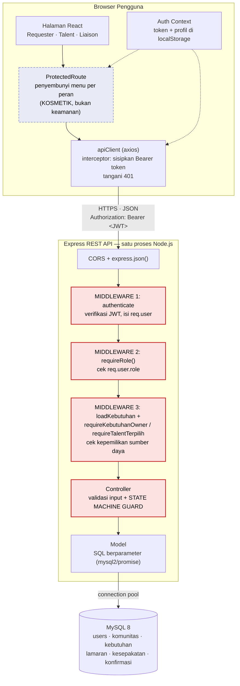
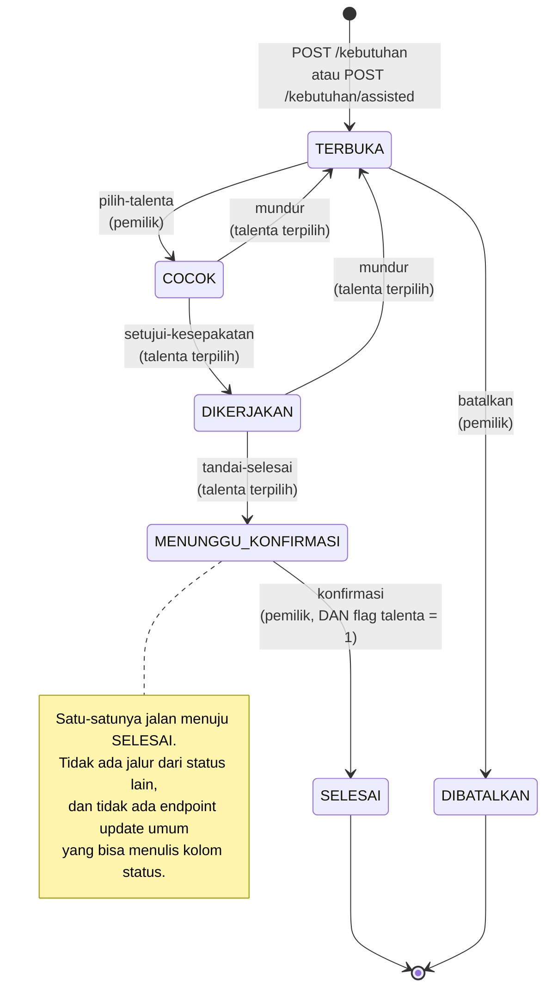
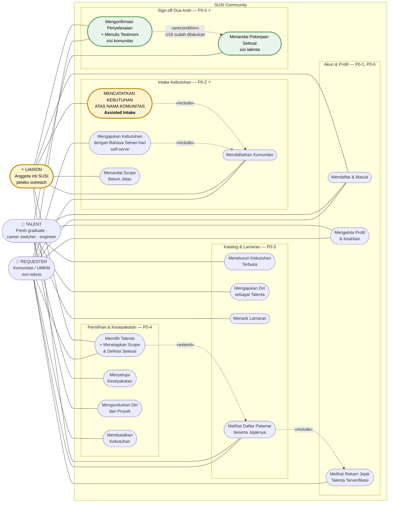
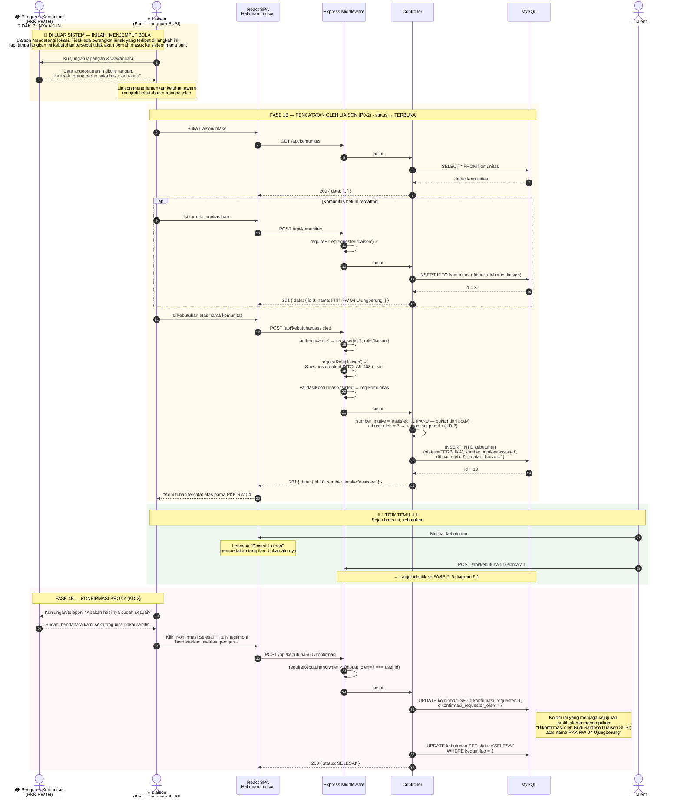
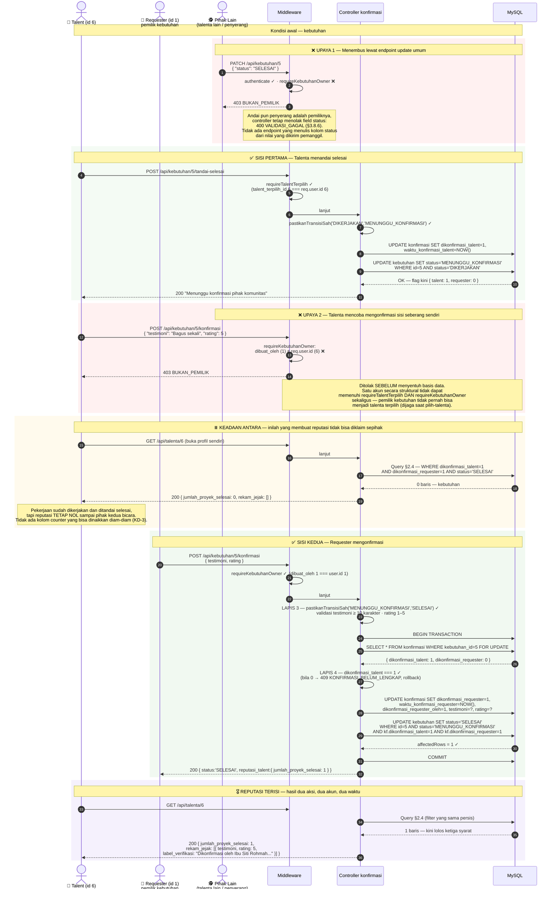
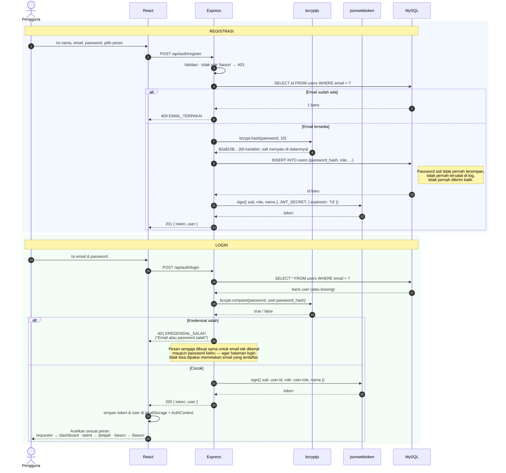
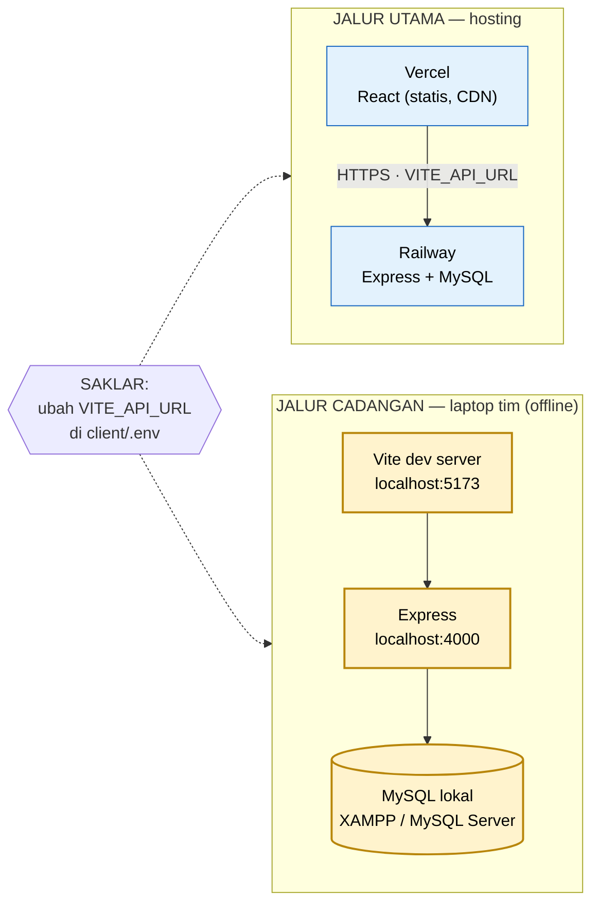

# SDD — SUSI Community v1

**System Design Document**
**Proyek:** SUSI Community — SATU CREANOVA 2026, kategori Web Programming (sub-tema Community Development)
**Turunan dari:** `PRD-SUSI-Community-v1.md` (v1.1)
**Stack:** React + Tailwind CSS · Node.js + Express (REST API) · MySQL 8 · JWT + bcrypt
**Versi:** 1.1 | **Status:** Disetujui — P0 terimplementasi
**Peran dokumen:** lampiran teknis proposal (BAB II Arsitektur Sistem, BAB III Struktur Database & Alur Sistem) sekaligus panduan implementasi saat final onsite.

> **Perubahan v1.0 → v1.1 (parsial).** Dua hal masuk, sisanya tidak disentuh:
> 1. **F7 Peta Komunitas (P1)** dari `addendum-SDD-F7-Peta-Komunitas.md` dilebur ke bagian yang relevan — KD-4 (§0.1), kolom `latitude`/`longitude` (§2.2), dua endpoint (§3.3), satu middleware (§4.2), satu halaman (§7.7), empat uji (§10.4).
> 2. **Bahasa visual** dari `susi-mockup.jsx` dibakukan sebagai §7.8, termasuk penggantian label `Liaison` → **Pendamping SUSI** pada seluruh teks antarmuka.
>
> Skema `kebutuhan`/`lamaran`/`kesepakatan`/`konfirmasi`, state machine, dan seluruh endpoint P0 **tidak berubah**. F7 murni aditif.

---

## Daftar Isi

| § | Bagian |
|---|---|
| 0 | Keputusan Desain & Konvensi |
| 1 | Ringkasan Arsitektur |
| 2 | Skema Database (ERD + DDL MySQL + Seed) |
| 3 | Spesifikasi REST API |
| 4 | Otorisasi & Middleware |
| 5 | Diagram Use Case |
| 6 | Sequence Diagram — Loop Inti |
| 7 | Struktur Halaman & Routing Frontend |
| 8 | Struktur Folder Proyek |
| 9 | Alur Autentikasi & Penentuan Peran |
| 10 | Rencana Pengujian Minimal |
| 11 | Rencana Deployment & Skenario Cadangan Demo |
| 12 | Open Questions untuk Tim |
| A | Lampiran — Matriks Ketertelusuran P0 |

---

## 0. Keputusan Desain & Konvensi

### 0.1 Keputusan yang menutup ambiguitas PRD

PRD v1.1 meninggalkan tiga titik yang tidak bisa dibiarkan menggantung karena berpengaruh langsung ke skema tabel dan endpoint. Keputusan diambil di sini, alasannya dicatat, dan pertanyaan lanjutannya dibawa ke §12. KD-4 menyusul bersama F7 di v1.1 dan mengikuti pola yang sama.

**KD-1 · State `COCOK` adalah state nyata, bukan transien.**
PRD §7 menggambar `TERBUKA → COCOK → DIKERJAKAN`, sementara P0-4 menuliskan keduanya seolah terjadi dalam satu aksi ("Saat memilih, Requester mengisi ringkasan scope & definisi selesai"). Kalau `COCOK` hanya lewat sepersekian detik di dalam satu transaksi, state itu tidak berguna dan kontrak P0-3 ("Kebutuhan yang sudah `COCOK` tidak lagi menerima lamaran") jadi tidak bisa diamati.

Keputusan: `COCOK` = Requester sudah memilih satu talenta **dan** sudah mendraf `ringkasan_scope` + `definisi_selesai`; kebutuhan berhenti menerima lamaran. Transisi `COCOK → DIKERJAKAN` memerlukan **aksi talenta terpilih** menyetujui kesepakatan itu. Dengan begitu frasa P0-4 "kedua pihak menyepakati" benar-benar dua arah, bukan klaim sepihak Requester. Biaya tambahannya satu klik dan satu endpoint — murah untuk sesuatu yang menjadi bahan cerita saat demo.

**KD-2 · Pemilik kebutuhan `assisted` adalah Liaison yang mencatatnya, tapi identitas pengonfirmasi tetap direkam.**
Komunitas hasil outreach pada umumnya tidak punya akun (itu justru alasan Assisted Intake ada). Maka untuk kebutuhan ber-`sumber_intake = 'assisted'`, Liaison memegang hak aksi sisi Requester: memilih talenta, menyepakati scope, mengonfirmasi penyelesaian.

Supaya ini tidak diam-diam melemahkan mesin reputasi, tabel `konfirmasi` menyimpan `dikonfirmasi_requester_oleh` (FK ke `users`). Profil talenta menampilkan testimoni apa adanya: *"Dikonfirmasi oleh Budi Santoso (Liaison SUSI) atas nama Komunitas UMKM Cibaduyut"*. Reputasi tetap terverifikasi, tapi tidak berpura-pura menjadi suara komunitas langsung. Jalur untuk komunitas mengambil alih akun sendiri dicatat di §12.

**KD-3 · Reputasi adalah nilai turunan (derived), bukan kolom counter.**
Tidak ada kolom `users.jumlah_proyek_selesai` atau `users.skor_reputasi`. Angka reputasi dihitung saat dibaca, lewat `JOIN` antara `kebutuhan` (status `SELESAI`) dan `konfirmasi` (kedua flag `TRUE`).

Alasannya adalah alasan keamanan, bukan kerapian: selama reputasi hanya berupa counter, akan selalu ada endpoint atau bug yang bisa menaikkannya tanpa melewati tabel `konfirmasi`. Sebagai turunan, **satu-satunya cara** menaikkan reputasi adalah membuat baris `konfirmasi` dengan dua flag `TRUE` — dan itu hanya bisa terjadi lewat dua aksi dari dua akun berbeda. P0-5 ("Reputasi **tidak** bertambah bila hanya satu pihak yang menandai") jadi dijamin oleh bentuk data, bukan oleh kedisiplinan penulis kode. Pada skala v1 (puluhan–ratusan baris) biaya query-nya nol.

**KD-4 · Hak edit lokasi komunitas memakai ulang pola kepemilikan yang sudah ada.** *(F7, P1)*
Yang boleh mengubah `latitude`/`longitude` sebuah komunitas adalah `users` yang tercatat sebagai `komunitas.dibuat_oleh`, atau peran `liaison` — persis pola KD-2 untuk kebutuhan ber-`sumber_intake = 'assisted'`.

Tidak ada aktor baru, tidak ada tabel kepemilikan baru. Godaan yang ditolak di sini adalah membuat tabel `pengelola_komunitas` "supaya fleksibel": F7 adalah fitur P1 yang boleh gugur kalau waktu onsite habis, dan fitur yang boleh gugur tidak layak menambah entitas yang harus ikut dipahami saat membaca skema. `komunitas.dibuat_oleh` yang sudah ada memadai.

### 0.2 Konvensi penamaan

| Aspek | Konvensi | Contoh |
|---|---|---|
| Nama tabel | Bahasa Indonesia, `snake_case`, **jamak** | `users`, `kebutuhan`, `lamaran` |
| Nama kolom | Bahasa Indonesia, `snake_case` | `deskripsi_awam`, `sumber_intake` |
| Nilai ENUM status kebutuhan | `HURUF_BESAR` persis seperti PRD §7 | `MENUNGGU_KONFIRMASI` |
| Nilai ENUM lain | `huruf_kecil` | `requester`, `assisted` |
| Path endpoint | Bahasa Indonesia, `kebab-case`, diawali `/api` | `/api/kebutuhan/:id/pilih-talenta` |
| Field JSON | `snake_case`, sama persis dengan nama kolom | `sumber_intake` |
| Nama file & variabel JS | `camelCase`; komponen React `PascalCase` | `kebutuhanController.js`, `KartuKebutuhan.jsx` |

> **Alasan satu bahasa untuk data dan API:** field JSON identik dengan nama kolom menghilangkan lapisan pemetaan nama. Saat onsite dengan waktu terbatas, kelas bug "kenapa `sumberIntake` undefined padahal di DB ada" adalah kelas bug yang paling tidak layak dibayar.

### 0.3 Format respons seragam

Seluruh endpoint memakai amplop yang sama. Frontend cukup menulis satu penangan sukses dan satu penangan galat.

```jsonc
// Sukses — 200 / 201
{ "data": { /* objek atau array */ } }

// Galat — 4xx / 5xx
{ "error": { "kode": "TRANSISI_TIDAK_SAH", "pesan": "Kebutuhan berstatus TERBUKA tidak dapat ditandai selesai." } }
```

**Kamus kode galat** (dipakai konsisten di seluruh §3):

| HTTP | `kode` | Arti |
|---|---|---|
| 400 | `VALIDASI_GAGAL` | Body tidak lengkap / format salah |
| 401 | `TIDAK_TERAUTENTIKASI` | Token tidak ada atau tidak valid |
| 401 | `TOKEN_KEDALUWARSA` | Token kedaluwarsa — frontend wajib logout & arahkan ke `/masuk` |
| 403 | `PERAN_TIDAK_DIIZINKAN` | Peran akun tidak berhak atas aksi ini |
| 403 | `BUKAN_PEMILIK` | Peran benar, tapi sumber daya milik orang lain |
| 404 | `TIDAK_DITEMUKAN` | Sumber daya tidak ada |
| 409 | `LAMARAN_GANDA` | Talenta sudah melamar kebutuhan ini (P0-3) |
| 409 | `TRANSISI_TIDAK_SAH` | Aksi tidak sah dari status saat ini (state machine guard) |
| 409 | `KONFIRMASI_BELUM_LENGKAP` | Upaya mencapai `SELESAI` padahal baru satu pihak konfirmasi |
| 500 | `KESALAHAN_SERVER` | Galat tak terduga |

---

## 1. Ringkasan Arsitektur

### 1.1 Diagram komponen



> **Cara membaca diagram ini:** kotak merah adalah **satu-satunya batas keamanan sistem**. Kotak biru putus-putus (`ProtectedRoute`) hanya merapikan tampilan — ia menyembunyikan tombol, tidak menjaga apa pun. Setiap request menembus keempat kotak merah secara berurutan; tidak ada jalur pintas dari React ke MySQL.

### 1.2 Pembagian tanggung jawab

| Lapisan | Tanggung jawab | Yang **bukan** tanggung jawabnya |
|---|---|---|
| **React SPA** | Render UI, form intake berbahasa awam, empty state, menyembunyikan aksi yang tidak relevan bagi peran aktif, menyimpan & mengirim token | **Menegakkan aturan akses.** Setiap tombol yang disembunyikan tetap harus ditolak server bila dipanggil langsung lewat curl/Postman |
| **Express — middleware** | Verifikasi JWT → identitas; cek peran → kelas aksi; cek kepemilikan → instans sumber daya | Aturan bisnis per-state (itu milik controller) |
| **Express — controller/service** | Validasi input, **state machine guard** (§4.4), orkestrasi transaksi, penyusunan respons | Query SQL mentah (didelegasikan ke model) |
| **Express — model** | Query SQL berparameter, pemetaan baris → objek | Keputusan otorisasi apa pun |
| **MySQL** | Integritas relasional: FK, `UNIQUE`, `ENUM`, `NOT NULL`, indeks | **Otorisasi.** MySQL tidak punya Row Level Security — tidak ada satu pun aturan "siapa boleh apa" yang dititipkan ke sini |

### 1.3 Mengapa monolit tiga lapis memadai untuk v1

- **Beban nyata sangat kecil.** Target pilot PRD §10 berskala puluhan kebutuhan dan puluhan pengguna. Satu proses Node dengan connection pool MySQL melayani beban ini tanpa mendekati batasnya. Memecah menjadi service terpisah hanya menambah titik gagal saat demo live.
- **Transisi status butuh transaksi lokal.** Aksi `pilih-talenta` menyentuh tiga tabel sekaligus (`kebutuhan`, `lamaran`, `kesepakatan`). Dalam satu proses ini cukup satu transaksi MySQL; dipecah jadi service terpisah, hal yang sama menuntut koordinasi terdistribusi — biaya besar untuk masalah yang tidak kita punya.
- **Otorisasi terpusat di satu tempat.** Karena tidak ada RLS (PRD §11), justru menguntungkan bahwa hanya ada **satu** pintu masuk ke database. Satu pintu = satu tempat yang harus diaudit, dan itu bisa dibaca habis dalam sepuluh menit oleh juri maupun anggota tim.
- **Frontend statis terpisah dari backend stateful.** React di-build jadi berkas statis (Vercel/Netlify, CDN), Express butuh proses hidup (Railway/Render). Pemisahan ini bukan microservice — ini konsekuensi wajar dari perbedaan sifat runtime, dan justru memudahkan skenario cadangan lokal di §11.
- **Ruang tumbuh sudah disiapkan.** `Komunitas` berdiri sebagai entitas sendiri (PRD §8, implikasi arsitektur P2), sehingga Tahap 2 & 3 tidak menuntut migrasi data besar. Yang dibangun sekarang tetap hanya P0.

---

## 2. Skema Database

### 2.1 ERD

```mermaid
erDiagram
    USERS ||--o{ KOMUNITAS : "mendaftarkan"
    USERS ||--o{ KEBUTUHAN : "membuat (dibuat_oleh)"
    USERS ||--o{ LAMARAN : "mengajukan (talent_id)"
    USERS |o--o{ KEBUTUHAN : "dikerjakan (talent_terpilih_id)"
    USERS ||--o{ KESEPAKATAN : "terikat sebagai talenta"
    USERS |o--o{ KONFIRMASI : "mengonfirmasi sisi requester"
    KOMUNITAS ||--o{ KEBUTUHAN : "memiliki"
    KEBUTUHAN ||--o{ LAMARAN : "menerima"
    KEBUTUHAN ||--o| KESEPAKATAN : "menghasilkan (0..1)"
    KEBUTUHAN ||--o| KONFIRMASI : "ditutup oleh (0..1)"

    USERS {
        int id PK
        varchar nama
        varchar email UK
        varchar password_hash
        enum role "requester|talent|liaison"
        text bio "nullable"
        varchar keahlian "nullable, CSV — hanya untuk talent"
        varchar kontak "nullable"
        datetime created_at
    }

    KOMUNITAS {
        int id PK
        varchar nama
        varchar jenis "UMKM|Karang Taruna|PKK|Hobi|Sekolah|Lainnya"
        varchar lokasi
        varchar kontak "nullable"
        int dibuat_oleh FK "users.id"
        datetime created_at
    }

    KEBUTUHAN {
        int id PK
        int komunitas_id FK
        varchar judul
        text deskripsi_awam
        varchar kategori
        varchar keahlian_dibutuhkan "nullable, CSV"
        enum status "TERBUKA|COCOK|DIKERJAKAN|MENUNGGU_KONFIRMASI|SELESAI|DIBATALKAN"
        enum sumber_intake "self-serve|assisted"
        int dibuat_oleh FK "users.id — pemilik kebutuhan"
        int talent_terpilih_id FK "nullable, users.id"
        text catatan_liaison "nullable"
        tinyint scope_perlu_diperjelas "flag user story 9"
        datetime created_at
        datetime updated_at
    }

    LAMARAN {
        int id PK
        int kebutuhan_id FK
        int talent_id FK
        text pesan
        enum status "MENUNGGU|DITERIMA|DITOLAK|DITARIK"
        datetime created_at
    }

    KESEPAKATAN {
        int id PK
        int kebutuhan_id FK UK "1:1 — satu kesepakatan aktif per kebutuhan"
        int talent_id FK
        text ringkasan_scope
        text definisi_selesai
        tinyint disetujui_talent "gerbang COCOK -> DIKERJAKAN"
        datetime tanggal_sepakat "nullable, terisi saat talenta menyetujui"
        datetime created_at
    }

    KONFIRMASI {
        int id PK
        int kebutuhan_id FK UK "1:1"
        int talent_id FK
        tinyint dikonfirmasi_talent
        tinyint dikonfirmasi_requester
        datetime waktu_konfirmasi_talent "nullable"
        datetime waktu_konfirmasi_requester "nullable"
        int dikonfirmasi_requester_oleh FK "nullable — jejak KD-2"
        text testimoni "nullable"
        tinyint rating "nullable, 1..5"
        datetime created_at
    }
```

**Catatan kardinalitas yang perlu diperhatikan saat implementasi:**

| Relasi | Kardinalitas | Ditegakkan oleh |
|---|---|---|
| `kebutuhan` → `lamaran` | 1 : 0..N | FK biasa |
| (`kebutuhan_id`, `talent_id`) pada `lamaran` | **unik** | `UNIQUE KEY uq_lamaran_kebutuhan_talent` — inilah P0-3 "tidak dapat melamar dua kali" |
| `kebutuhan` → `kesepakatan` | 1 : 0..1 | `UNIQUE` pada `kebutuhan_id` |
| `kebutuhan` → `konfirmasi` | 1 : 0..1 | `UNIQUE` pada `kebutuhan_id` |
| `kebutuhan.talent_terpilih_id` | 0..1 talenta | `NULL` selama `TERBUKA`; terisi sejak `COCOK` |

> **Kenapa `kesepakatan` dan `konfirmasi` dipisah dari `kebutuhan` padahal 1:0..1?**
> Keduanya bisa saja jadi kolom tambahan di `kebutuhan`. Dipisah karena dua alasan: (a) `konfirmasi` adalah bukti reputasi — ia layak jadi baris tersendiri yang bisa dirujuk profil talenta tanpa membaca seluruh kebutuhan; (b) memisahkannya membuat aturan "reputasi hanya lahir dari baris `konfirmasi` bermata dua" (KD-3) terlihat kasat mata dalam skema, bukan tersembunyi di antara belasan kolom.

### 2.2 DDL MySQL

Skrip berikut siap dijalankan apa adanya pada **MySQL 8.0+**. Simpan sebagai `server/db/schema.sql`.

```sql
-- =====================================================================
-- SUSI Community v1 — Skema Database
-- MySQL 8.0+ · InnoDB · utf8mb4
-- Jalankan: mysql -u root -p < server/db/schema.sql
-- =====================================================================

DROP DATABASE IF EXISTS susi_community;
CREATE DATABASE susi_community
  CHARACTER SET utf8mb4
  COLLATE utf8mb4_unicode_ci;
USE susi_community;

-- ---------------------------------------------------------------------
-- 1. users — Requester, Talent, Liaison dalam satu tabel
-- ---------------------------------------------------------------------
CREATE TABLE users (
  id             INT UNSIGNED NOT NULL AUTO_INCREMENT,
  nama           VARCHAR(100) NOT NULL,
  email          VARCHAR(150) NOT NULL,
  password_hash  VARCHAR(255) NOT NULL,          -- bcrypt, cost 10
  role           ENUM('requester','talent','liaison') NOT NULL,
  bio            TEXT NULL,                      -- ringkasan diri talenta
  keahlian       VARCHAR(255) NULL,              -- CSV: "React,Excel,Desain Poster"
  kontak         VARCHAR(100) NULL,              -- nomor WA / kontak lain
  created_at     DATETIME NOT NULL DEFAULT CURRENT_TIMESTAMP,
  updated_at     DATETIME NOT NULL DEFAULT CURRENT_TIMESTAMP
                                ON UPDATE CURRENT_TIMESTAMP,
  PRIMARY KEY (id),
  UNIQUE KEY uq_users_email (email),
  KEY idx_users_role (role)
) ENGINE=InnoDB DEFAULT CHARSET=utf8mb4 COLLATE=utf8mb4_unicode_ci;

-- ---------------------------------------------------------------------
-- 2. komunitas — entitas mandiri (PRD §8: prasyarat Tahap 2 & 3)
--    Untuk jalur assisted, dibuat_oleh = akun liaison.
--    latitude/longitude NULL sampai ketua komunitas menandai titiknya (F7).
--    Sengaja NULLABLE: komunitas tetap sah tanpa koordinat, dan seluruh
--    alur P0 tidak boleh menunggu fitur P1 terisi.
-- ---------------------------------------------------------------------
CREATE TABLE komunitas (
  id           INT UNSIGNED NOT NULL AUTO_INCREMENT,
  nama         VARCHAR(150) NOT NULL,
  jenis        ENUM('UMKM','Karang Taruna','PKK','Komunitas Hobi',
                    'Panitia Sekolah','Lainnya') NOT NULL DEFAULT 'Lainnya',
  lokasi       VARCHAR(150) NOT NULL,       -- alamat teks, selalu terisi
  latitude     DECIMAL(10,7) NULL,          -- F7: titik kumpul di peta
  longitude    DECIMAL(10,7) NULL,          -- NULL = belum ditandai
  kontak       VARCHAR(100) NULL,
  dibuat_oleh  INT UNSIGNED NOT NULL,
  created_at   DATETIME NOT NULL DEFAULT CURRENT_TIMESTAMP,
  PRIMARY KEY (id),
  KEY idx_komunitas_dibuat_oleh (dibuat_oleh),
  KEY idx_komunitas_koordinat (latitude, longitude),  -- F7: saring yang sudah bertitik
  CONSTRAINT fk_komunitas_pembuat
    FOREIGN KEY (dibuat_oleh) REFERENCES users (id)
    ON DELETE RESTRICT ON UPDATE CASCADE
) ENGINE=InnoDB DEFAULT CHARSET=utf8mb4 COLLATE=utf8mb4_unicode_ci;

-- ---------------------------------------------------------------------
-- 3. kebutuhan — inti sistem; kolom status & sumber_intake adalah
--    dua kolom terpenting di seluruh basis data ini.
-- ---------------------------------------------------------------------
CREATE TABLE kebutuhan (
  id                     INT UNSIGNED NOT NULL AUTO_INCREMENT,
  komunitas_id           INT UNSIGNED NOT NULL,
  judul                  VARCHAR(200) NOT NULL,
  deskripsi_awam         TEXT NOT NULL,          -- bahasa sehari-hari (P0-2)
  kategori               VARCHAR(80) NOT NULL,
  keahlian_dibutuhkan    VARCHAR(255) NULL,      -- CSV, opsional
  status                 ENUM('TERBUKA','COCOK','DIKERJAKAN',
                              'MENUNGGU_KONFIRMASI','SELESAI','DIBATALKAN')
                         NOT NULL DEFAULT 'TERBUKA',
  sumber_intake          ENUM('self-serve','assisted') NOT NULL
                         DEFAULT 'self-serve',   -- PEMBEDA UTAMA SUSI
  dibuat_oleh            INT UNSIGNED NOT NULL,  -- pemilik kebutuhan (KD-2)
  talent_terpilih_id     INT UNSIGNED NULL,
  catatan_liaison        TEXT NULL,              -- konteks hasil kunjungan lapangan
  scope_perlu_diperjelas TINYINT(1) NOT NULL DEFAULT 0,  -- user story #9
  created_at             DATETIME NOT NULL DEFAULT CURRENT_TIMESTAMP,
  updated_at             DATETIME NOT NULL DEFAULT CURRENT_TIMESTAMP
                                      ON UPDATE CURRENT_TIMESTAMP,
  PRIMARY KEY (id),
  KEY idx_kebutuhan_status (status),
  KEY idx_kebutuhan_komunitas (komunitas_id),
  KEY idx_kebutuhan_pemilik (dibuat_oleh),
  KEY idx_kebutuhan_talent (talent_terpilih_id),
  KEY idx_kebutuhan_sumber (sumber_intake),
  KEY idx_kebutuhan_katalog (status, created_at),  -- katalog publik P0-3
  CONSTRAINT fk_kebutuhan_komunitas
    FOREIGN KEY (komunitas_id) REFERENCES komunitas (id)
    ON DELETE CASCADE ON UPDATE CASCADE,
  CONSTRAINT fk_kebutuhan_pembuat
    FOREIGN KEY (dibuat_oleh) REFERENCES users (id)
    ON DELETE RESTRICT ON UPDATE CASCADE,
  CONSTRAINT fk_kebutuhan_talent
    FOREIGN KEY (talent_terpilih_id) REFERENCES users (id)
    ON DELETE SET NULL ON UPDATE CASCADE
) ENGINE=InnoDB DEFAULT CHARSET=utf8mb4 COLLATE=utf8mb4_unicode_ci;

-- ---------------------------------------------------------------------
-- 4. lamaran — UNIQUE (kebutuhan_id, talent_id) memenuhi P0-3
-- ---------------------------------------------------------------------
CREATE TABLE lamaran (
  id            INT UNSIGNED NOT NULL AUTO_INCREMENT,
  kebutuhan_id  INT UNSIGNED NOT NULL,
  talent_id     INT UNSIGNED NOT NULL,
  pesan         TEXT NOT NULL,                   -- alasan & keahlian relevan
  status        ENUM('MENUNGGU','DITERIMA','DITOLAK','DITARIK')
                NOT NULL DEFAULT 'MENUNGGU',
  created_at    DATETIME NOT NULL DEFAULT CURRENT_TIMESTAMP,
  updated_at    DATETIME NOT NULL DEFAULT CURRENT_TIMESTAMP
                             ON UPDATE CURRENT_TIMESTAMP,
  PRIMARY KEY (id),
  UNIQUE KEY uq_lamaran_kebutuhan_talent (kebutuhan_id, talent_id),
  KEY idx_lamaran_talent (talent_id),
  KEY idx_lamaran_status (status),
  CONSTRAINT fk_lamaran_kebutuhan
    FOREIGN KEY (kebutuhan_id) REFERENCES kebutuhan (id)
    ON DELETE CASCADE ON UPDATE CASCADE,
  CONSTRAINT fk_lamaran_talent
    FOREIGN KEY (talent_id) REFERENCES users (id)
    ON DELETE CASCADE ON UPDATE CASCADE
) ENGINE=InnoDB DEFAULT CHARSET=utf8mb4 COLLATE=utf8mb4_unicode_ci;

-- ---------------------------------------------------------------------
-- 5. kesepakatan — scope & definisi selesai (P0-4)
--    disetujui_talent adalah gerbang COCOK -> DIKERJAKAN (KD-1)
-- ---------------------------------------------------------------------
CREATE TABLE kesepakatan (
  id               INT UNSIGNED NOT NULL AUTO_INCREMENT,
  kebutuhan_id     INT UNSIGNED NOT NULL,
  talent_id        INT UNSIGNED NOT NULL,
  ringkasan_scope  TEXT NOT NULL,
  definisi_selesai TEXT NOT NULL,
  disetujui_talent TINYINT(1) NOT NULL DEFAULT 0,
  tanggal_sepakat  DATETIME NULL,                -- terisi saat talenta setuju
  created_at       DATETIME NOT NULL DEFAULT CURRENT_TIMESTAMP,
  PRIMARY KEY (id),
  UNIQUE KEY uq_kesepakatan_kebutuhan (kebutuhan_id),
  KEY idx_kesepakatan_talent (talent_id),
  CONSTRAINT fk_kesepakatan_kebutuhan
    FOREIGN KEY (kebutuhan_id) REFERENCES kebutuhan (id)
    ON DELETE CASCADE ON UPDATE CASCADE,
  CONSTRAINT fk_kesepakatan_talent
    FOREIGN KEY (talent_id) REFERENCES users (id)
    ON DELETE CASCADE ON UPDATE CASCADE
) ENGINE=InnoDB DEFAULT CHARSET=utf8mb4 COLLATE=utf8mb4_unicode_ci;

-- ---------------------------------------------------------------------
-- 6. konfirmasi — MESIN REPUTASI (P0-5)
--    SELESAI hanya sah bila dikonfirmasi_talent = 1 AND
--    dikonfirmasi_requester = 1. Ditegakkan di controller (§4.4);
--    CHECK di bawah adalah jaring pengaman lapis kedua.
-- ---------------------------------------------------------------------
CREATE TABLE konfirmasi (
  id                           INT UNSIGNED NOT NULL AUTO_INCREMENT,
  kebutuhan_id                 INT UNSIGNED NOT NULL,
  talent_id                    INT UNSIGNED NOT NULL,
  dikonfirmasi_talent          TINYINT(1) NOT NULL DEFAULT 0,
  dikonfirmasi_requester       TINYINT(1) NOT NULL DEFAULT 0,
  waktu_konfirmasi_talent      DATETIME NULL,
  waktu_konfirmasi_requester   DATETIME NULL,
  dikonfirmasi_requester_oleh  INT UNSIGNED NULL,  -- jejak KD-2
  testimoni                    TEXT NULL,
  rating                       TINYINT UNSIGNED NULL,
  created_at                   DATETIME NOT NULL DEFAULT CURRENT_TIMESTAMP,
  updated_at                   DATETIME NOT NULL DEFAULT CURRENT_TIMESTAMP
                                            ON UPDATE CURRENT_TIMESTAMP,
  PRIMARY KEY (id),
  UNIQUE KEY uq_konfirmasi_kebutuhan (kebutuhan_id),
  KEY idx_konfirmasi_talent (talent_id),
  CONSTRAINT chk_konfirmasi_rating
    CHECK (rating IS NULL OR (rating BETWEEN 1 AND 5)),
  CONSTRAINT fk_konfirmasi_kebutuhan
    FOREIGN KEY (kebutuhan_id) REFERENCES kebutuhan (id)
    ON DELETE CASCADE ON UPDATE CASCADE,
  CONSTRAINT fk_konfirmasi_talent
    FOREIGN KEY (talent_id) REFERENCES users (id)
    ON DELETE CASCADE ON UPDATE CASCADE,
  CONSTRAINT fk_konfirmasi_pengonfirmasi
    FOREIGN KEY (dikonfirmasi_requester_oleh) REFERENCES users (id)
    ON DELETE SET NULL ON UPDATE CASCADE
) ENGINE=InnoDB DEFAULT CHARSET=utf8mb4 COLLATE=utf8mb4_unicode_ci;
```

### 2.3 Penjelasan pilihan `ON DELETE`

Perilaku penghapusan dipilih per relasi, bukan seragam. Alasannya:

| Relasi | Perilaku | Alasan |
|---|---|---|
| `komunitas.dibuat_oleh` → `users` | `RESTRICT` | Menghapus akun tidak boleh menghilangkan komunitas hasil outreach. Sistem memaksa tim menangani kasus ini secara sadar. |
| `kebutuhan.komunitas_id` → `komunitas` | `CASCADE` | Kebutuhan tidak punya makna tanpa komunitas pemiliknya. |
| `kebutuhan.dibuat_oleh` → `users` | `RESTRICT` | Melindungi jejak: kebutuhan `SELESAI` tidak boleh lenyap karena satu akun dihapus. |
| `kebutuhan.talent_terpilih_id` → `users` | `SET NULL` | Bila akun talenta hilang, kebutuhan tetap ada dan bisa dibuka ulang. |
| `lamaran.*` | `CASCADE` | Lamaran adalah data turunan murni; tanpa kebutuhan atau talenta ia tak bermakna. |
| `kesepakatan.*`, `konfirmasi.*` (ke `kebutuhan`/`talent`) | `CASCADE` | Ikut siklus hidup kebutuhan. |
| `konfirmasi.dikonfirmasi_requester_oleh` → `users` | `SET NULL` | Testimoni tetap ada meski akun pengonfirmasi dihapus; atribusi saja yang hilang. |

> **Catatan MySQL 5.7:** `CHECK` pada `rating` di-parse tapi **diabaikan** oleh MySQL 5.7. Validasi rentang 1–5 tetap wajib ada di controller Express. Jika laptop demo memakai XAMPP lawas, periksa versinya lebih dulu (`SELECT VERSION();`) — lihat §11.4.

### 2.4 Query reputasi (implementasi KD-3)

Tidak ada kolom reputasi. Angka pada profil talenta lahir dari query ini:

```sql
-- Rekam jejak terverifikasi seorang talenta (P0-6)
SELECT  k.id            AS kebutuhan_id,
        k.judul,
        k.kategori,
        k.sumber_intake,
        km.nama         AS nama_komunitas,
        kf.testimoni,
        kf.rating,
        kf.waktu_konfirmasi_requester AS tanggal_selesai,
        pengonfirmasi.nama AS dikonfirmasi_oleh_nama,
        pengonfirmasi.role AS dikonfirmasi_oleh_peran
FROM    konfirmasi kf
JOIN    kebutuhan  k  ON k.id = kf.kebutuhan_id
JOIN    komunitas  km ON km.id = k.komunitas_id
LEFT JOIN users pengonfirmasi ON pengonfirmasi.id = kf.dikonfirmasi_requester_oleh
WHERE   kf.talent_id = ?
  AND   kf.dikonfirmasi_talent = 1        -- kedua flag wajib
  AND   kf.dikonfirmasi_requester = 1     -- inilah P0-5
  AND   k.status = 'SELESAI'
ORDER BY kf.waktu_konfirmasi_requester DESC;
```

Perhatikan tiga kondisi di `WHERE`: selama ketiganya dituntut bersamaan, tidak ada cara menaikkan reputasi tanpa dua aksi dari dua akun berbeda.

### 2.5 Seed data untuk demo

**Satu langkah wajib sebelum menjalankan skrip ini.** Password seed tidak bisa saya tuliskan sebagai hash bcrypt jadi — hash bcrypt mengandung salt acak, dan hash yang saya karang tidak akan lolos `bcrypt.compare()`. Akibatnya login gagal justru saat demo. Jadi: **hasilkan hash-nya sendiri, lalu tempel.**

```bash
# Jalankan sekali di folder /server (setelah `npm i bcryptjs`)
node -e "console.log(require('bcryptjs').hashSync('susi123', 10))"
# Contoh keluaran: $2a$10$xxxxxxxxxxxxxxxxxxxxxxxxxxxxxxxxxxxxxxxxxxxxxxxxxxxxx
```

Salin keluarannya, lalu **find-replace** seluruh token `__HASH_SUSI123__` di `seed.sql` dengan nilai tersebut. Semua akun seed memakai password yang sama: **`susi123`**.

Simpan sebagai `server/db/seed.sql`, jalankan setelah `schema.sql`.

```sql
-- =====================================================================
-- SUSI Community v1 — Seed Data Demo
-- Prasyarat: schema.sql sudah dijalankan
-- Password semua akun: susi123
-- GANTI __HASH_SUSI123__ dengan hash bcrypt hasil perintah node di atas.
-- =====================================================================
USE susi_community;

SET FOREIGN_KEY_CHECKS = 0;
TRUNCATE TABLE konfirmasi;
TRUNCATE TABLE kesepakatan;
TRUNCATE TABLE lamaran;
TRUNCATE TABLE kebutuhan;
TRUNCATE TABLE komunitas;
TRUNCATE TABLE users;
SET FOREIGN_KEY_CHECKS = 1;

-- ---------------------------------------------------------------------
-- USERS — 2 requester, 4 talent, 1 liaison
-- ---------------------------------------------------------------------
INSERT INTO users (id, nama, email, password_hash, role, bio, keahlian, kontak) VALUES
(1, 'Ibu Siti Rohmah',   'siti@umkm.test',      '__HASH_SUSI123__', 'requester',
 'Pengurus paguyuban UMKM Cibaduyut, mengelola 24 pelaku usaha sepatu.', NULL, '081200000001'),
(2, 'Pak Deden Hidayat', 'deden@karta.test',    '__HASH_SUSI123__', 'requester',
 'Ketua Karang Taruna RW 08 Antapani.', NULL, '081200000002'),

(3, 'Rizky Ananda',      'rizky@talenta.test',  '__HASH_SUSI123__', 'talent',
 'Fresh graduate Teknik Informatika, mencari proyek nyata pertama.',
 'React,JavaScript,MySQL', '081300000003'),
(4, 'Nabila Putri',      'nabila@talenta.test', '__HASH_SUSI123__', 'talent',
 'Career switcher dari akuntansi ke data. Terbiasa merapikan data berantakan.',
 'Excel,Google Sheets,Data Entry,Looker Studio', '081300000004'),
(5, 'Fajar Nugroho',     'fajar@talenta.test',  '__HASH_SUSI123__', 'talent',
 'Junior engineer, 1 tahun pengalaman web. Sudah menyelesaikan proyek komunitas.',
 'Laravel,PHP,MySQL,Desain Poster', '081300000005'),
(6, 'Alya Rahmawati',    'alya@talenta.test',   '__HASH_SUSI123__', 'talent',
 'Mahasiswa tingkat akhir DKV, fokus desain identitas visual UMKM.',
 'Figma,Canva,Desain Poster,Branding', '081300000006'),

(7, 'Budi Santoso',      'budi@susi.test',      '__HASH_SUSI123__', 'liaison',
 'Anggota inti SUSI, penanggung jawab outreach wilayah Bandung Timur.', NULL, '081400000007');

-- ---------------------------------------------------------------------
-- KOMUNITAS — 3 komunitas; #3 tidak punya akun sendiri (murni assisted)
-- ---------------------------------------------------------------------
INSERT INTO komunitas (id, nama, jenis, lokasi, kontak, dibuat_oleh) VALUES
(1, 'Paguyuban UMKM Sepatu Cibaduyut', 'UMKM',            'Cibaduyut, Bandung', '081200000001', 1),
(2, 'Karang Taruna RW 08 Antapani',    'Karang Taruna',   'Antapani, Bandung',  '081200000002', 2),
-- Didaftarkan liaison saat kunjungan lapangan; pengurusnya tidak punya akun (KD-2)
(3, 'PKK RW 04 Ujungberung',           'PKK',             'Ujungberung, Bandung','081400000007', 7);

-- ---------------------------------------------------------------------
-- KEBUTUHAN — mencakup 5 status berbeda + kedua sumber_intake
-- ---------------------------------------------------------------------
INSERT INTO kebutuhan
  (id, komunitas_id, judul, deskripsi_awam, kategori, keahlian_dibutuhkan,
   status, sumber_intake, dibuat_oleh, talent_terpilih_id, catatan_liaison,
   scope_perlu_diperjelas, created_at) VALUES

-- [1] TERBUKA · self-serve · sudah punya 2 pelamar
(1, 1, 'Catatan penjualan saya berantakan',
 'Tiap hari saya catat penjualan di buku tulis, sering hilang dan susah dihitung akhir bulan. Pengen ada cara yang lebih rapi tapi jangan yang ribet.',
 'Pencatatan & Data', 'Excel,Google Sheets', 'TERBUKA', 'self-serve', 1, NULL, NULL, 0,
 DATE_SUB(NOW(), INTERVAL 12 DAY)),

-- [2] TERBUKA · ASSISTED · belum ada pelamar (untuk demo empty state pelamar)
(2, 3, 'Data anggota PKK masih ditulis tangan',
 'Ibu-ibu PKK punya sekitar 80 anggota, datanya masih di buku. Kalau mau cari data satu orang harus dibuka satu-satu. Ingin bisa dicari lebih cepat.',
 'Pencatatan & Data', 'Excel,Google Sheets,Data Entry', 'TERBUKA', 'assisted', 7, NULL,
 'Hasil kunjungan 12 Agustus. Pengurus tidak terbiasa memakai laptop; serah terima nanti perlu didampingi langsung.',
 0, DATE_SUB(NOW(), INTERVAL 5 DAY)),

-- [3] COCOK · self-serve · talenta terpilih, menunggu persetujuan kesepakatan (KD-1)
(3, 2, 'Pendaftaran lomba 17 Agustus masih lewat WhatsApp satu-satu',
 'Tiap tahun panitia kewalahan mendata peserta lomba karena semua daftar lewat chat pribadi. Sering ada yang kelewat.',
 'Formulir & Pendaftaran', 'Google Forms,Spreadsheet', 'COCOK', 'self-serve', 2, 4, NULL, 0,
 DATE_SUB(NOW(), INTERVAL 20 DAY)),

-- [4] DIKERJAKAN · ASSISTED · kesepakatan sudah disetujui kedua pihak
(4, 3, 'Kegiatan PKK tidak ada dokumentasi yang bisa dilihat warga',
 'Setiap kegiatan cuma difoto lalu hilang di galeri HP. Warga tidak tahu PKK sedang mengerjakan apa.',
 'Publikasi & Promosi', 'Desain Poster,Canva', 'DIKERJAKAN', 'assisted', 7, 6,
 'Hasil kunjungan 2 Agustus. Sudah ada 40+ foto kegiatan yang siap dipakai.', 0,
 DATE_SUB(NOW(), INTERVAL 25 DAY)),

-- [5] MENUNGGU_KONFIRMASI · self-serve · talenta sudah menandai selesai
--     >>> INI KEBUTUHAN YANG DIPAKAI SAAT DEMO SIGN-OFF DUA ARAH <<<
(5, 1, 'Belum punya katalog produk yang bisa dikirim ke pembeli',
 'Kalau ada yang tanya produk, saya kirim foto satu-satu lewat WA. Pengen ada satu file katalog yang tinggal dikirim.',
 'Publikasi & Promosi', 'Figma,Canva,Desain Poster', 'MENUNGGU_KONFIRMASI', 'self-serve', 1, 6, NULL, 0,
 DATE_SUB(NOW(), INTERVAL 35 DAY)),

-- [6] SELESAI · self-serve · sudah bertestimoni → mengisi reputasi Fajar
(6, 2, 'Jadwal ronda sering bentrok dan tidak ada yang pegang',
 'Jadwal ronda dibuat di kertas, sering hilang, akhirnya banyak yang tidak tahu gilirannya kapan.',
 'Penjadwalan', 'Spreadsheet,Web Sederhana', 'SELESAI', 'self-serve', 2, 5, NULL, 0,
 DATE_SUB(NOW(), INTERVAL 60 DAY)),

-- [7] SELESAI · ASSISTED · membuktikan jalur assisted bisa tuntas sampai reputasi
(7, 3, 'Iuran bulanan sering telat ditagih karena tidak ada catatan',
 'Bendahara lupa siapa yang sudah bayar dan siapa yang belum, karena catatannya tercecer.',
 'Pencatatan & Data', 'Excel,Google Sheets', 'SELESAI', 'assisted', 7, 4,
 'Hasil kunjungan 20 Juni. Bendahara sudah bisa pakai HP, cukup Google Sheets.', 0,
 DATE_SUB(NOW(), INTERVAL 70 DAY)),

-- [8] DIBATALKAN · self-serve · kebutuhan ditarik pemiliknya
(8, 1, 'Ingin bikin aplikasi kasir sendiri',
 'Kepikiran mau punya aplikasi kasir, tapi setelah dipikir lagi belum terlalu perlu sekarang.',
 'Aplikasi', NULL, 'DIBATALKAN', 'self-serve', 1, NULL, NULL, 1,
 DATE_SUB(NOW(), INTERVAL 40 DAY));

-- ---------------------------------------------------------------------
-- LAMARAN
-- ---------------------------------------------------------------------
INSERT INTO lamaran (kebutuhan_id, talent_id, pesan, status, created_at) VALUES
-- Kebutuhan 1 (TERBUKA) — 2 pelamar, keduanya masih MENUNGGU
(1, 4, 'Saya biasa merapikan data penjualan pakai Google Sheets. Bisa saya buatkan yang tinggal isi, lalu totalnya jalan otomatis. Saya juga siap ajari cara pakainya.', 'MENUNGGU', DATE_SUB(NOW(), INTERVAL 9 DAY)),
(1, 3, 'Saya bisa bantu buatkan pencatatan sederhana. Kalau nanti perlu, bisa dikembangkan jadi web kecil.', 'MENUNGGU', DATE_SUB(NOW(), INTERVAL 6 DAY)),

-- Kebutuhan 3 (COCOK) — Nabila diterima, Rizky otomatis ditolak
(3, 4, 'Saya bisa buatkan formulir pendaftaran online yang datanya langsung masuk spreadsheet.', 'DITERIMA', DATE_SUB(NOW(), INTERVAL 18 DAY)),
(3, 3, 'Tertarik membantu, saya sudah pernah membuat form pendaftaran serupa.', 'DITOLAK', DATE_SUB(NOW(), INTERVAL 17 DAY)),

-- Kebutuhan 4, 5, 6, 7 — pelamar yang diterima
(4, 6, 'Saya mahasiswa DKV, bisa bantu buatkan template poster kegiatan yang tinggal ganti foto dan teks.', 'DITERIMA', DATE_SUB(NOW(), INTERVAL 23 DAY)),
(5, 6, 'Saya bisa susun katalog produk dalam satu file PDF yang rapi dan siap dikirim lewat WA.', 'DITERIMA', DATE_SUB(NOW(), INTERVAL 33 DAY)),
(6, 5, 'Saya bisa buatkan halaman jadwal ronda sederhana yang bisa dibuka dari HP.', 'DITERIMA', DATE_SUB(NOW(), INTERVAL 58 DAY)),
(7, 4, 'Saya bisa buatkan pencatatan iuran otomatis; bendahara tinggal centang siapa yang sudah bayar.', 'DITERIMA', DATE_SUB(NOW(), INTERVAL 68 DAY));

-- ---------------------------------------------------------------------
-- KESEPAKATAN
-- Kebutuhan 3 disetujui_talent = 0 → itulah sebabnya statusnya masih COCOK
-- ---------------------------------------------------------------------
INSERT INTO kesepakatan
  (kebutuhan_id, talent_id, ringkasan_scope, definisi_selesai, disetujui_talent, tanggal_sepakat) VALUES
(3, 4, 'Membuat formulir pendaftaran lomba online beserta rekap peserta otomatis dalam spreadsheet.',
     'Selesai bila formulir dapat diisi dari HP, data peserta masuk otomatis, dan panitia sudah dapat membuka rekapnya sendiri.',
     0, NULL),
(4, 6, 'Membuat 3 template poster kegiatan PKK yang dapat diganti foto dan teksnya secara mandiri.',
     'Selesai bila 3 template tersedia di Canva, sudah dibagikan aksesnya, dan pengurus sudah mencoba mengganti isinya sekali.',
     1, DATE_SUB(NOW(), INTERVAL 22 DAY)),
(5, 6, 'Menyusun katalog produk sepatu dalam satu berkas PDF berisi minimal 15 produk beserta harga.',
     'Selesai bila berkas PDF katalog diterima, dapat dikirim lewat WhatsApp, dan seluruh harga sudah dikoreksi pemilik usaha.',
     1, DATE_SUB(NOW(), INTERVAL 32 DAY)),
(6, 5, 'Membuat halaman jadwal ronda sederhana yang dapat dibuka dari ponsel.',
     'Selesai bila halaman dapat diakses warga dan jadwal satu bulan penuh sudah terisi.',
     1, DATE_SUB(NOW(), INTERVAL 57 DAY)),
(7, 4, 'Membuat pencatatan iuran bulanan berbasis spreadsheet dengan penanda status bayar.',
     'Selesai bila bendahara dapat mencatat pembayaran sendiri dan rekap tunggakan muncul otomatis.',
     1, DATE_SUB(NOW(), INTERVAL 67 DAY));

-- ---------------------------------------------------------------------
-- KONFIRMASI — perhatikan pola flag-nya
-- ---------------------------------------------------------------------
INSERT INTO konfirmasi
  (kebutuhan_id, talent_id, dikonfirmasi_talent, dikonfirmasi_requester,
   waktu_konfirmasi_talent, waktu_konfirmasi_requester,
   dikonfirmasi_requester_oleh, testimoni, rating) VALUES

-- Kebutuhan 4 (DIKERJAKAN): baris sudah ada, kedua flag masih 0
(4, 6, 0, 0, NULL, NULL, NULL, NULL, NULL),

-- Kebutuhan 5 (MENUNGGU_KONFIRMASI): HANYA talenta yang konfirmasi.
-- Reputasi Alya BELUM bertambah dari sini — bukti hidup P0-5 saat demo.
(5, 6, 1, 0, DATE_SUB(NOW(), INTERVAL 2 DAY), NULL, NULL, NULL, NULL),

-- Kebutuhan 6 (SELESAI): dua arah, dikonfirmasi langsung oleh Requester
(6, 5, 1, 1, DATE_SUB(NOW(), INTERVAL 31 DAY), DATE_SUB(NOW(), INTERVAL 30 DAY), 2,
 'Halaman jadwalnya dipakai terus sampai sekarang. Fajar sabar menjelaskan ke pengurus yang gaptek, tidak pernah membuat kami merasa bodoh.', 5),

-- Kebutuhan 7 (SELESAI, assisted): dikonfirmasi LIAISON atas nama komunitas (KD-2)
(7, 4, 1, 1, DATE_SUB(NOW(), INTERVAL 41 DAY), DATE_SUB(NOW(), INTERVAL 40 DAY), 7,
 'Bendahara PKK sekarang bisa mencatat iuran sendiri tanpa dibantu. Nabila datang dua kali untuk memastikan ibu-ibu benar-benar bisa memakainya.', 5);
```

**Kondisi awal yang dihasilkan seed ini — dan kenapa dipilih begitu:**

| Yang tersedia setelah seed | Untuk apa saat demo |
|---|---|
| Kebutuhan #2 & #4 & #7 ber-`sumber_intake = 'assisted'` | Menunjukkan pembeda utama SUSI, termasuk satu yang sudah tuntas sampai reputasi (#7) |
| Kebutuhan #5 berstatus `MENUNGGU_KONFIRMASI` | **Titik mulai demo sign-off dua arah** — cukup satu klik Requester untuk memperlihatkan reputasi bertambah live |
| Baris `konfirmasi` #5 dengan flag `1,0` | Bukti kasat mata P0-5: profil Alya belum menampilkan proyek ini sampai pihak kedua konfirmasi |
| Kebutuhan #2 tanpa satu pun lamaran | Demo empty state pelamar (user story #10 & #12) |
| Kebutuhan #1 dengan 2 pelamar `MENUNGGU` | Demo memilih talenta dari beberapa kandidat (P0-4) |
| Kebutuhan #3 berstatus `COCOK`, `disetujui_talent = 0` | Demo gerbang persetujuan talenta (KD-1) |
| Kebutuhan #8 `DIBATALKAN` | Membuktikan state machine lengkap tanpa harus membatalkan apa pun saat demo |

> **Disiplin demo:** jangan pernah menyunting basis data lewat phpMyAdmin di depan juri. Semua perubahan state harus lahir dari aksi di antarmuka — itulah yang dinilai pada komponen Fungsionalitas Sistem.

---

## 3. Spesifikasi REST API

**Base URL:** `/api` · **Format:** JSON · **Autentikasi:** header `Authorization: Bearer <JWT>`

> **Catatan format.** Kolom "contoh request body" dan "contoh response" tidak dimuat ke dalam sel tabel karena JSON multi-baris membuat tabel tak terbaca. Struktur yang dipakai: **§3.2–3.7 tabel ringkas per domain** (Method · Path · Peran · Deskripsi · Kode galat), lalu **§3.8 blok detail** berisi contoh request & response untuk setiap endpoint. Isinya lengkap, hanya tata letaknya yang dipisah.

### 3.1 Dua aturan desain yang mengikat seluruh tabel di bawah

**Aturan A — Status tidak pernah bisa ditulis lewat endpoint update umum.**
`PATCH /api/kebutuhan/:id` **menolak** field `status`, `sumber_intake`, `talent_terpilih_id`, dan `komunitas_id` — bukan mengabaikannya diam-diam, tapi membalas `400 VALIDASI_GAGAL`. Menolak secara berisik lebih baik daripada mengabaikan diam-diam: bug jenis ini muncul saat demo, bukan saat coding.

Setiap perpindahan status punya endpoint aksinya sendiri, dan setiap endpoint aksi memvalidasi prasyaratnya:

| Transisi | Endpoint aksi | Pelaku |
|---|---|---|
| `TERBUKA → COCOK` | `POST /api/kebutuhan/:id/pilih-talenta` | Pemilik kebutuhan |
| `COCOK → DIKERJAKAN` | `POST /api/kebutuhan/:id/setujui-kesepakatan` | Talenta terpilih |
| `DIKERJAKAN → MENUNGGU_KONFIRMASI` | `POST /api/kebutuhan/:id/tandai-selesai` | Talenta terpilih |
| `MENUNGGU_KONFIRMASI → SELESAI` | `POST /api/kebutuhan/:id/konfirmasi` | Pemilik kebutuhan |
| `COCOK / DIKERJAKAN → TERBUKA` | `POST /api/kebutuhan/:id/mundur` | Talenta terpilih |
| `TERBUKA → DIBATALKAN` | `POST /api/kebutuhan/:id/batalkan` | Pemilik kebutuhan |

**Aturan B — Assisted Intake adalah endpoint terpisah, bukan parameter.**
`POST /api/kebutuhan/assisted` berdiri sendiri dan hanya dapat diakses peran `liaison`. Jalur self-serve (`POST /api/kebutuhan`) **selalu** menulis `sumber_intake = 'self-serve'`, nilainya di-hardcode di controller dan tidak pernah dibaca dari body.

Kenapa bukan satu endpoint dengan field `sumber_intake` di body? Karena bila nilainya datang dari body, siapa pun yang bisa membuat kebutuhan bisa mengaku `assisted`, dan metrik G2 ("≥50% kebutuhan dari jalur Assisted Intake") langsung kehilangan makna. Memisahkan endpoint membuat pemeriksaan perannya cuma satu baris di router — dan tidak ada jalan memutarinya.

### 3.2 Domain: Auth

| Method | Path | Peran | Deskripsi | Kode galat |
|---|---|---|---|---|
| `POST` | `/api/auth/register` | Publik | Daftar akun baru; `role` dipilih saat registrasi | `400 VALIDASI_GAGAL`, `409 EMAIL_TERPAKAI` |
| `POST` | `/api/auth/login` | Publik | Masuk, mengembalikan JWT + profil | `400 VALIDASI_GAGAL`, `401 KREDENSIAL_SALAH` |
| `GET` | `/api/auth/me` | Semua terautentikasi | Profil akun aktif; dipakai saat refresh halaman | `401 TIDAK_TERAUTENTIKASI`, `401 TOKEN_KEDALUWARSA` |

> **Catatan peran saat registrasi.** Peran `requester` dan `talent` bebas dipilih pendaftar. Peran **`liaison` tidak boleh** didaftarkan lewat endpoint publik — controller menolaknya dengan `403 PERAN_TIDAK_DIIZINKAN`. Akun liaison hanya lahir dari seed. Alasannya sederhana: liaison memegang hak proxy sisi Requester (KD-2), jadi membiarkannya dipilih bebas sama saja membagikan kunci pintu belakang kepada siapa pun yang membuka halaman daftar.

### 3.3 Domain: Komunitas

| Method | Path | Peran | Deskripsi | Kode galat |
|---|---|---|---|---|
| `GET` | `/api/komunitas` | Terautentikasi | Daftar komunitas; `?milik_saya=true` menyaring milik akun aktif | `401` |
| `GET` | `/api/komunitas/:id` | Terautentikasi | Detail satu komunitas | `401`, `404 TIDAK_DITEMUKAN` |
| `POST` | `/api/komunitas` | `requester`, `liaison` | Daftarkan komunitas. Requester mendaftarkan komunitasnya sendiri; Liaison mendaftarkan komunitas hasil kunjungan lapangan | `400`, `401`, `403 PERAN_TIDAK_DIIZINKAN` |
| `GET` | `/api/komunitas/peta` | Terautentikasi | **(F7)** Komunitas yang `latitude`+`longitude`-nya sudah terisi, beserta jumlah `kebutuhan` berstatus `TERBUKA` per komunitas | `401` |
| `PATCH` | `/api/komunitas/:id/lokasi` | Pemilik (`dibuat_oleh`) atau `liaison` | **(F7)** Isi/ubah `latitude` & `longitude`. Menolak field lain di luar keduanya | `400 VALIDASI_GAGAL`, `401`, `403 BUKAN_PEMILIK`, `404` |

> **Urutan rute penting.** `/api/komunitas/peta` harus didaftarkan **sebelum** `/api/komunitas/:id`, kalau tidak Express membaca `peta` sebagai nilai `:id` dan endpoint peta tidak akan pernah tercapai. Ini kelas bug yang mahal karena gejalanya (`404 TIDAK_DITEMUKAN`, atau `400` dari parsing id) tidak menunjuk ke penyebabnya sama sekali.
>
> **Validasi rentang koordinat.** `latitude` wajib −90..90 dan `longitude` −180..180; keduanya wajib dikirim bersamaan. Menerima salah satu saja menghasilkan pin yang tidak bisa digambar — lebih baik ditolak `400` di gerbang daripada menjadi baris data yang diam-diam tidak muncul di peta.

### 3.4 Domain: Kebutuhan

| Method | Path | Peran | Deskripsi | Kode galat |
|---|---|---|---|---|
| `GET` | `/api/kebutuhan` | Terautentikasi | Katalog. Filter: `?status=`, `?komunitas_id=`, `?sumber_intake=`, `?milik_saya=true`. Tanpa filter, peran `talent` hanya menerima status `TERBUKA` | `401` |
| `GET` | `/api/kebutuhan/:id` | Terautentikasi | Detail + komunitas + kesepakatan + ringkasan konfirmasi. Field `catatan_liaison` hanya dikirim ke pemilik & liaison | `401`, `404` |
| `POST` | `/api/kebutuhan` | `requester` | **Jalur self-serve.** `sumber_intake` dipaksa `'self-serve'` | `400`, `401`, `403`, `404` (komunitas tak ada) |
| `POST` | `/api/kebutuhan/assisted` | **`liaison` saja** | **Jalur assisted.** `sumber_intake` dipaksa `'assisted'`; menerima `catatan_liaison` & `scope_perlu_diperjelas` | `400`, `401`, `403 PERAN_TIDAK_DIIZINKAN`, `404` |
| `PATCH` | `/api/kebutuhan/:id` | Pemilik kebutuhan | Sunting `judul`, `deskripsi_awam`, `kategori`, `keahlian_dibutuhkan`, `scope_perlu_diperjelas`. **Menolak** field status | `400 VALIDASI_GAGAL`, `401`, `403 BUKAN_PEMILIK`, `404`, `409 TRANSISI_TIDAK_SAH` (bila status bukan `TERBUKA`/`COCOK`) |
| `GET` | `/api/kebutuhan/:id/lamaran` | Pemilik kebutuhan | Daftar pelamar + profil + rekam jejak terverifikasi (P0-3, P0-6) | `401`, `403 BUKAN_PEMILIK`, `404` |

### 3.5 Domain: Lamaran

| Method | Path | Peran | Deskripsi | Kode galat |
|---|---|---|---|---|
| `POST` | `/api/kebutuhan/:id/lamaran` | `talent` | Ajukan diri. Ditolak bila status ≠ `TERBUKA` atau sudah pernah melamar | `400`, `401`, `403 PERAN_TIDAK_DIIZINKAN`, `404`, `409 LAMARAN_GANDA`, `409 TRANSISI_TIDAK_SAH` |
| `GET` | `/api/lamaran/saya` | `talent` | Riwayat lamaran akun aktif beserta status kebutuhannya | `401`, `403` |
| `DELETE` | `/api/lamaran/:id` | Pemilik lamaran | Tarik lamaran; hanya sah bila lamaran masih `MENUNGGU`. Status jadi `DITARIK`, baris tidak dihapus | `401`, `403 BUKAN_PEMILIK`, `404`, `409 TRANSISI_TIDAK_SAH` |

> Lamaran ditarik dengan mengubah status menjadi `DITARIK`, bukan `DELETE` baris. Jika barisnya dihapus, constraint `UNIQUE (kebutuhan_id, talent_id)` ikut lepas dan talenta bisa melamar-menarik berulang kali. Jejaknya juga hilang.

### 3.6 Domain: Kesepakatan & Transisi Status

| Method | Path | Peran | Deskripsi | Kode galat |
|---|---|---|---|---|
| `POST` | `/api/kebutuhan/:id/pilih-talenta` | Pemilik kebutuhan | Pilih satu pelamar + isi `ringkasan_scope` & `definisi_selesai`. Transaksi: `kebutuhan → COCOK`, lamaran terpilih `DITERIMA`, sisanya `DITOLAK`, buat baris `kesepakatan` | `400`, `401`, `403 BUKAN_PEMILIK`, `404`, `409 TRANSISI_TIDAK_SAH` |
| `GET` | `/api/kebutuhan/:id/kesepakatan` | Pemilik atau talenta terpilih | Lihat kesepakatan (P0-4: terlihat kedua pihak) | `401`, `403 BUKAN_PEMILIK`, `404` |
| `POST` | `/api/kebutuhan/:id/setujui-kesepakatan` | **Talenta terpilih saja** | Setujui scope → `COCOK → DIKERJAKAN`; isi `tanggal_sepakat`; buat baris `konfirmasi` kosong | `401`, `403 BUKAN_PEMILIK`, `404`, `409 TRANSISI_TIDAK_SAH` |
| `POST` | `/api/kebutuhan/:id/mundur` | **Talenta terpilih saja** | Undur diri (user story #11) → status kembali `TERBUKA`, `talent_terpilih_id` dikosongkan, kesepakatan & konfirmasi dihapus, lamaran jadi `DITARIK` | `401`, `403 BUKAN_PEMILIK`, `404`, `409 TRANSISI_TIDAK_SAH` |
| `POST` | `/api/kebutuhan/:id/batalkan` | Pemilik kebutuhan | Tarik kebutuhan → `DIBATALKAN`. Hanya sah dari `TERBUKA` | `401`, `403 BUKAN_PEMILIK`, `404`, `409 TRANSISI_TIDAK_SAH` |

### 3.7 Domain: Konfirmasi & Profil/Reputasi

| Method | Path | Peran | Deskripsi | Kode galat |
|---|---|---|---|---|
| `POST` | `/api/kebutuhan/:id/tandai-selesai` | **Talenta terpilih saja** | Sisi pertama sign-off → `DIKERJAKAN → MENUNGGU_KONFIRMASI`, `dikonfirmasi_talent = 1` | `401`, `403 BUKAN_PEMILIK`, `404`, `409 TRANSISI_TIDAK_SAH` |
| `POST` | `/api/kebutuhan/:id/konfirmasi` | Pemilik kebutuhan | Sisi kedua sign-off + testimoni → **`SELESAI`**. Guard: hanya sah bila `dikonfirmasi_talent = 1` | `400`, `401`, `403 BUKAN_PEMILIK`, `404`, `409 TRANSISI_TIDAK_SAH`, `409 KONFIRMASI_BELUM_LENGKAP` |
| `GET` | `/api/kebutuhan/:id/konfirmasi` | Pemilik atau talenta terpilih | Status kedua flag + testimoni | `401`, `403 BUKAN_PEMILIK`, `404` |
| `GET` | `/api/talenta/:id` | **Publik** | Profil publik: keahlian, bio, daftar proyek `SELESAI` + testimoni (P0-6). Memakai query §2.4 | `404 TIDAK_DITEMUKAN` |
| `PATCH` | `/api/profil` | Terautentikasi | Sunting `nama`, `bio`, `keahlian`, `kontak` milik sendiri. **Tidak bisa** mengubah `role` atau `email` | `400`, `401` |

> **`GET /api/talenta/:id` sengaja dibuat publik tanpa token.** Requester yang belum punya akun harus bisa melihat rekam jejak talenta — itu inti dari mengurangi keraguan terhadap orang asing (Goal G5). Endpoint ini hanya mengembalikan data yang memang dimaksudkan publik: nama, bio, keahlian, proyek selesai, testimoni. **Tidak** mengembalikan email, `password_hash`, atau kontak.
>
> **`role` tidak dapat diubah lewat `PATCH /api/profil`.** Bila bisa, siapa pun tinggal mengubah dirinya menjadi `liaison` dan seluruh matriks otorisasi §4 runtuh dalam satu request. Perubahan peran hanya lewat akses langsung ke basis data.

### 3.8 Detail request & response

#### 3.8.1 `POST /api/auth/register`

```jsonc
// Request
{
  "nama": "Rizky Ananda",
  "email": "rizky@talenta.test",
  "password": "susi123",
  "role": "talent",                       // "requester" | "talent" — "liaison" ditolak
  "keahlian": "React,JavaScript,MySQL"    // opsional, relevan untuk talent
}

// 201 Created
{
  "data": {
    "token": "eyJhbGciOiJIUzI1NiIsInR5cCI6IkpXVCJ9...",
    "user": { "id": 3, "nama": "Rizky Ananda", "email": "rizky@talenta.test", "role": "talent" }
  }
}

// 409 Conflict
{ "error": { "kode": "EMAIL_TERPAKAI", "pesan": "Email sudah terdaftar. Silakan masuk." } }

// 403 Forbidden — upaya mendaftar sebagai liaison
{ "error": { "kode": "PERAN_TIDAK_DIIZINKAN", "pesan": "Peran liaison tidak dapat didaftarkan secara mandiri." } }
```

#### 3.8.2 `POST /api/auth/login`

```jsonc
// Request
{ "email": "siti@umkm.test", "password": "susi123" }

// 200 OK
{
  "data": {
    "token": "eyJhbGciOiJIUzI1NiIsInR5cCI6IkpXVCJ9...",
    "user": { "id": 1, "nama": "Ibu Siti Rohmah", "email": "siti@umkm.test", "role": "requester" }
  }
}

// 401 Unauthorized — email salah MAUPUN password salah membalas pesan yang sama,
// agar tidak membocorkan email mana yang terdaftar.
{ "error": { "kode": "KREDENSIAL_SALAH", "pesan": "Email atau password salah." } }
```

#### 3.8.3 `POST /api/kebutuhan` — jalur self-serve

```jsonc
// Request  (peran: requester)
{
  "komunitas_id": 1,
  "judul": "Catatan penjualan saya berantakan",
  "deskripsi_awam": "Tiap hari saya catat penjualan di buku tulis, sering hilang...",
  "kategori": "Pencatatan & Data",
  "keahlian_dibutuhkan": "Excel,Google Sheets"
}
// Perhatikan: TIDAK ADA field "status" dan "sumber_intake".
// Keduanya ditetapkan server: 'TERBUKA' dan 'self-serve'.

// 201 Created
{
  "data": {
    "id": 9, "komunitas_id": 1,
    "judul": "Catatan penjualan saya berantakan",
    "status": "TERBUKA",
    "sumber_intake": "self-serve",
    "dibuat_oleh": 1,
    "talent_terpilih_id": null,
    "created_at": "2026-09-24T09:12:44.000Z"
  }
}
```

#### 3.8.4 `POST /api/kebutuhan/assisted` — jalur assisted (liaison saja) ⭐

```jsonc
// Request  (peran: liaison — dijaga requireRole('liaison'))
{
  "komunitas_id": 3,
  "judul": "Data anggota PKK masih ditulis tangan",
  "deskripsi_awam": "Ibu-ibu PKK punya sekitar 80 anggota, datanya masih di buku...",
  "kategori": "Pencatatan & Data",
  "keahlian_dibutuhkan": "Excel,Google Sheets,Data Entry",
  "catatan_liaison": "Hasil kunjungan 12 Agustus. Pengurus tidak terbiasa memakai laptop; serah terima perlu didampingi.",
  "scope_perlu_diperjelas": false
}

// 201 Created
{
  "data": {
    "id": 10, "komunitas_id": 3,
    "judul": "Data anggota PKK masih ditulis tangan",
    "status": "TERBUKA",
    "sumber_intake": "assisted",          // ditetapkan server, bukan dari body
    "dibuat_oleh": 7,                     // akun liaison = pemilik kebutuhan (KD-2)
    "catatan_liaison": "Hasil kunjungan 12 Agustus...",
    "scope_perlu_diperjelas": false,
    "komunitas": { "id": 3, "nama": "PKK RW 04 Ujungberung", "jenis": "PKK", "lokasi": "Ujungberung, Bandung" }
  }
}

// 403 Forbidden — requester/talent mencoba memakai jalur ini
{ "error": { "kode": "PERAN_TIDAK_DIIZINKAN", "pesan": "Hanya Liaison yang dapat mencatatkan kebutuhan atas nama komunitas." } }
```

#### 3.8.5 `GET /api/kebutuhan?status=TERBUKA` — katalog talenta

```jsonc
// 200 OK
{
  "data": [
    {
      "id": 1,
      "judul": "Catatan penjualan saya berantakan",
      "deskripsi_singkat": "Tiap hari saya catat penjualan di buku tulis, sering hilang dan susah dihitung...",
      "kategori": "Pencatatan & Data",
      "keahlian_dibutuhkan": ["Excel", "Google Sheets"],
      "status": "TERBUKA",
      "sumber_intake": "self-serve",
      "jumlah_pelamar": 2,
      "sudah_saya_lamar": false,           // dihitung server dari req.user.id
      "komunitas": { "id": 1, "nama": "Paguyuban UMKM Sepatu Cibaduyut", "jenis": "UMKM", "lokasi": "Cibaduyut, Bandung" },
      "created_at": "2026-09-12T04:00:00.000Z"
    },
    {
      "id": 2,
      "judul": "Data anggota PKK masih ditulis tangan",
      "kategori": "Pencatatan & Data",
      "status": "TERBUKA",
      "sumber_intake": "assisted",         // frontend menampilkan lencana "Dicatat Liaison"
      "jumlah_pelamar": 0,
      "sudah_saya_lamar": false,
      "komunitas": { "id": 3, "nama": "PKK RW 04 Ujungberung", "jenis": "PKK", "lokasi": "Ujungberung, Bandung" }
    }
  ]
}
```

> Field `sudah_saya_lamar` dihitung di server, bukan ditebak frontend. Tanpa ini, halaman katalog harus menembak endpoint lamaran satu per satu untuk tahu tombol mana yang perlu dinonaktifkan.

#### 3.8.6 `PATCH /api/kebutuhan/:id` — penolakan field status

```jsonc
// Request yang sah
{ "judul": "Catatan penjualan harian belum rapi", "kategori": "Pencatatan & Data" }
// 200 OK → { "data": { ...kebutuhan terbaru... } }

// Request yang DITOLAK — inti mitigasi risiko PRD §12
{ "judul": "Judul baru", "status": "SELESAI" }

// 400 Bad Request
{
  "error": {
    "kode": "VALIDASI_GAGAL",
    "pesan": "Field 'status' tidak dapat diubah melalui endpoint ini. Gunakan endpoint aksi transisi yang sesuai.",
    "field_ditolak": ["status"]
  }
}
```

#### 3.8.7 `POST /api/kebutuhan/:id/lamaran`

```jsonc
// Request  (peran: talent)
{ "pesan": "Saya biasa merapikan data penjualan pakai Google Sheets. Bisa saya buatkan yang tinggal isi..." }

// 201 Created
{ "data": { "id": 12, "kebutuhan_id": 1, "talent_id": 3, "status": "MENUNGGU", "created_at": "2026-09-24T09:30:00.000Z" } }

// 409 Conflict — lamaran kedua pada kebutuhan yang sama (P0-3)
{ "error": { "kode": "LAMARAN_GANDA", "pesan": "Anda sudah melamar kebutuhan ini." } }

// 409 Conflict — kebutuhan sudah tidak menerima lamaran (P0-3)
{ "error": { "kode": "TRANSISI_TIDAK_SAH", "pesan": "Kebutuhan berstatus COCOK tidak lagi menerima lamaran." } }
```

#### 3.8.8 `GET /api/kebutuhan/:id/lamaran` — daftar pelamar bagi pemilik

```jsonc
// 200 OK  (hanya pemilik kebutuhan; talenta lain menerima 403 BUKAN_PEMILIK)
{
  "data": [
    {
      "lamaran_id": 3,
      "pesan": "Saya bisa buatkan formulir pendaftaran online yang datanya langsung masuk spreadsheet.",
      "status": "MENUNGGU",
      "created_at": "2026-09-15T02:10:00.000Z",
      "talent": {
        "id": 4,
        "nama": "Nabila Putri",
        "bio": "Career switcher dari akuntansi ke data.",
        "keahlian": ["Excel", "Google Sheets", "Data Entry", "Looker Studio"],
        "jumlah_proyek_selesai": 1,        // turunan §2.4 — bukan kolom (KD-3)
        "rata_rata_rating": 5.0,
        "testimoni_terakhir": "Bendahara PKK sekarang bisa mencatat iuran sendiri tanpa dibantu..."
      }
    }
  ]
}
```

> Inilah tempat P0-6 bertemu P0-3: Requester menilai orang asing dengan melihat jejak terverifikasinya, bukan klaim di kolom pesan. `jumlah_proyek_selesai` di sini **selalu** hasil query §2.4 — bila suatu saat angka ini terlihat naik tanpa ada baris `konfirmasi` bermata dua, itu bug serius, bukan fitur.

#### 3.8.9 `POST /api/kebutuhan/:id/pilih-talenta` — `TERBUKA → COCOK`

```jsonc
// Request  (pemilik kebutuhan)
{
  "lamaran_id": 3,
  "ringkasan_scope": "Membuat formulir pendaftaran lomba online beserta rekap peserta otomatis dalam spreadsheet.",
  "definisi_selesai": "Selesai bila formulir dapat diisi dari HP, data peserta masuk otomatis, dan panitia sudah dapat membuka rekapnya sendiri."
}

// 200 OK
{
  "data": {
    "kebutuhan": { "id": 3, "status": "COCOK", "talent_terpilih_id": 4 },
    "kesepakatan": {
      "id": 6, "kebutuhan_id": 3, "talent_id": 4,
      "ringkasan_scope": "Membuat formulir pendaftaran lomba online...",
      "definisi_selesai": "Selesai bila formulir dapat diisi dari HP...",
      "disetujui_talent": false,          // gerbang KD-1 — masih menunggu talenta
      "tanggal_sepakat": null
    },
    "lamaran_ditolak": [4]                // pelamar lain otomatis DITOLAK
  }
}

// 409 Conflict
{ "error": { "kode": "TRANSISI_TIDAK_SAH", "pesan": "Talenta hanya dapat dipilih saat kebutuhan berstatus TERBUKA. Status saat ini: DIKERJAKAN." } }

// 403 Forbidden — bukan pemilik
{ "error": { "kode": "BUKAN_PEMILIK", "pesan": "Anda bukan pemilik kebutuhan ini." } }
```

Seluruh operasi berjalan dalam **satu transaksi MySQL**: ubah status kebutuhan, set `talent_terpilih_id`, tandai lamaran terpilih `DITERIMA`, tandai sisanya `DITOLAK`, sisipkan baris `kesepakatan`. Bila salah satu gagal, semuanya di-*rollback*. Tanpa transaksi, kegagalan di tengah menghasilkan kebutuhan berstatus `COCOK` tanpa kesepakatan — state yang tidak punya jalan keluar di UI.

#### 3.8.10 `POST /api/kebutuhan/:id/setujui-kesepakatan` — `COCOK → DIKERJAKAN`

```jsonc
// Request: body kosong (persetujuan adalah aksi, bukan data)
{}

// 200 OK
{
  "data": {
    "kebutuhan": { "id": 3, "status": "DIKERJAKAN" },
    "kesepakatan": { "id": 6, "disetujui_talent": true, "tanggal_sepakat": "2026-09-24T10:02:00.000Z" }
  }
}

// 403 Forbidden — talenta lain, atau requester, mencoba menyetujui
{ "error": { "kode": "BUKAN_PEMILIK", "pesan": "Hanya talenta terpilih yang dapat menyetujui kesepakatan ini." } }
```

Pada langkah ini pula baris `konfirmasi` dibuat dengan kedua flag `0`. Membuatnya di sini, bukan saat talenta menandai selesai, membuat status sign-off selalu bisa ditampilkan sejak pekerjaan dimulai — Requester melihat "0 dari 2 pihak mengonfirmasi" sepanjang `DIKERJAKAN`, bukan halaman kosong.

#### 3.8.11 `POST /api/kebutuhan/:id/tandai-selesai` — `DIKERJAKAN → MENUNGGU_KONFIRMASI`

```jsonc
// Request  (talenta terpilih), body kosong
{}

// 200 OK
{
  "data": {
    "kebutuhan": { "id": 5, "status": "MENUNGGU_KONFIRMASI" },
    "konfirmasi": {
      "dikonfirmasi_talent": true,
      "dikonfirmasi_requester": false,
      "waktu_konfirmasi_talent": "2026-09-24T10:15:00.000Z"
    },
    "pesan": "Menunggu konfirmasi dari pihak komunitas. Reputasi Anda akan bertambah setelah pihak kedua mengonfirmasi."
  }
}
```

> Kalimat pada field `pesan` bukan hiasan. Ia menjelaskan kepada talenta bahwa pekerjaannya **belum** terhitung — persis aturan yang membuat reputasi SUSI tidak bisa diklaim sepihak. Menyembunyikan fakta ini hanya melahirkan pertanyaan "kok proyek saya tidak muncul di profil?"

#### 3.8.12 `POST /api/kebutuhan/:id/konfirmasi` — `MENUNGGU_KONFIRMASI → SELESAI` ⭐

```jsonc
// Request  (pemilik kebutuhan)
{
  "testimoni": "Katalognya rapi dan langsung bisa dipakai kirim ke pembeli. Alya juga sabar waktu saya minta revisi harga.",
  "rating": 5                              // opsional (lihat §12 OQ-4)
}

// 200 OK
{
  "data": {
    "kebutuhan": { "id": 5, "status": "SELESAI" },
    "konfirmasi": {
      "dikonfirmasi_talent": true,
      "dikonfirmasi_requester": true,
      "waktu_konfirmasi_talent": "2026-09-22T10:15:00.000Z",
      "waktu_konfirmasi_requester": "2026-09-24T10:20:00.000Z",
      "dikonfirmasi_requester_oleh": { "id": 1, "nama": "Ibu Siti Rohmah", "role": "requester" },
      "testimoni": "Katalognya rapi dan langsung bisa dipakai...",
      "rating": 5
    },
    "reputasi_talent": { "talent_id": 6, "jumlah_proyek_selesai": 1 }
  }
}

// 409 Conflict — GUARD UTAMA: talenta belum menandai selesai
{
  "error": {
    "kode": "KONFIRMASI_BELUM_LENGKAP",
    "pesan": "Talenta belum menandai pekerjaan ini selesai. Status SELESAI memerlukan konfirmasi kedua pihak."
  }
}

// 409 Conflict — dipanggil dari status yang salah, mis. DIKERJAKAN
{ "error": { "kode": "TRANSISI_TIDAK_SAH", "pesan": "Konfirmasi hanya dapat dilakukan saat kebutuhan berstatus MENUNGGU_KONFIRMASI. Status saat ini: DIKERJAKAN." } }
```

#### 3.8.13 `POST /api/kebutuhan/:id/mundur` — `COCOK | DIKERJAKAN → TERBUKA`

```jsonc
// Request  (talenta terpilih) — user story #11
{ "alasan": "Jadwal kuliah saya berubah, khawatir tidak bisa menyelesaikan tepat waktu." }

// 200 OK
{
  "data": {
    "kebutuhan": { "id": 4, "status": "TERBUKA", "talent_terpilih_id": null },
    "pesan": "Anda telah mengundurkan diri. Kebutuhan kembali terbuka untuk pelamar lain."
  }
}

// 409 Conflict — sudah terlanjur MENUNGGU_KONFIRMASI atau SELESAI
{ "error": { "kode": "TRANSISI_TIDAK_SAH", "pesan": "Pengunduran diri hanya dapat dilakukan saat status COCOK atau DIKERJAKAN." } }
```

Dalam satu transaksi: kesepakatan dan baris konfirmasi dihapus, lamaran talenta menjadi `DITARIK`, lamaran yang sebelumnya `DITOLAK` **dikembalikan** ke `MENUNGGU` agar Requester tidak perlu menunggu pelamar baru dari nol, `talent_terpilih_id` dikosongkan, status kembali `TERBUKA`.

#### 3.8.14 `GET /api/talenta/:id` — profil publik & rekam jejak (P0-6)

```jsonc
// 200 OK — tanpa token
{
  "data": {
    "id": 4,
    "nama": "Nabila Putri",
    "bio": "Career switcher dari akuntansi ke data. Terbiasa merapikan data berantakan.",
    "keahlian": ["Excel", "Google Sheets", "Data Entry", "Looker Studio"],
    "jumlah_proyek_selesai": 1,
    "rata_rata_rating": 5.0,
    "rekam_jejak": [
      {
        "kebutuhan_id": 7,
        "judul": "Iuran bulanan sering telat ditagih karena tidak ada catatan",
        "kategori": "Pencatatan & Data",
        "sumber_intake": "assisted",
        "nama_komunitas": "PKK RW 04 Ujungberung",
        "tanggal_selesai": "2026-08-15T03:00:00.000Z",
        "testimoni": "Bendahara PKK sekarang bisa mencatat iuran sendiri tanpa dibantu...",
        "rating": 5,
        "dikonfirmasi_oleh": { "nama": "Budi Santoso", "peran": "liaison" },
        "label_verifikasi": "Dikonfirmasi oleh Budi Santoso (Liaison SUSI) atas nama PKK RW 04 Ujungberung"
      }
    ]
  }
}
// Tidak memuat email, kontak, maupun password_hash.
```

Field `label_verifikasi` adalah wujud KD-2: pembaca profil tahu persis siapa yang menandatangani. Untuk kebutuhan self-serve, labelnya berbunyi "Dikonfirmasi oleh Pak Deden Hidayat (Karang Taruna RW 08 Antapani)".

---

## 4. Otorisasi & Middleware

> **Premis bagian ini.** MySQL tidak punya Row Level Security. Tidak ada satu pun aturan "siapa boleh apa" yang bisa dititipkan ke basis data. Seluruhnya hidup di Express — dan karena itu bagian ini adalah bagian paling penting dari SDD ini. Frontend, sekali lagi, hanya menyembunyikan tombol.

### 4.1 Matriks peran × aksi × sumber daya

Legenda: ✅ boleh · ❌ ditolak · 🔒 boleh **hanya untuk sumber daya miliknya** · 👁 baca saja

| Sumber daya / Aksi | `requester` | `talent` | `liaison` | Publik (tanpa token) |
|---|---|---|---|---|
| **Akun & Profil** | | | | |
| Registrasi (`requester`/`talent`) | ✅ | ✅ | ❌ (hanya via seed) | ✅ |
| Sunting profil sendiri | 🔒 | 🔒 | 🔒 | ❌ |
| Ubah `role` atau `email` sendiri | ❌ | ❌ | ❌ | ❌ |
| Lihat profil publik talenta | ✅ | ✅ | ✅ | ✅ 👁 |
| **Komunitas** | | | | |
| Daftarkan komunitas | ✅ | ❌ | ✅ | ❌ |
| Lihat daftar komunitas | 👁 | 👁 | 👁 | ❌ |
| **Kebutuhan** | | | | |
| Buat — jalur `self-serve` | ✅ | ❌ | ❌ | ❌ |
| Buat — jalur `assisted` ⭐ | ❌ | ❌ | ✅ | ❌ |
| Lihat katalog `TERBUKA` | 👁 | 👁 | 👁 | ❌ |
| Lihat detail kebutuhan miliknya | 🔒 | ❌ | 🔒 | ❌ |
| Lihat `catatan_liaison` | 🔒 | ❌ | ✅ | ❌ |
| Sunting isi (bukan status) | 🔒 | ❌ | 🔒 | ❌ |
| **Ubah kolom `status` langsung** | ❌ | ❌ | ❌ | ❌ |
| Batalkan kebutuhan | 🔒 | ❌ | 🔒 | ❌ |
| **Lamaran** | | | | |
| Melamar kebutuhan | ❌ | ✅ | ❌ | ❌ |
| Melamar dua kali kebutuhan sama | ❌ | ❌ | ❌ | ❌ |
| Lihat daftar pelamar | 🔒 | ❌ | 🔒 | ❌ |
| Tarik lamaran sendiri | ❌ | 🔒 | ❌ | ❌ |
| **Kesepakatan** | | | | |
| Pilih talenta + draf scope | 🔒 | ❌ | 🔒 | ❌ |
| Setujui kesepakatan | ❌ | 🔒 talenta terpilih | ❌ | ❌ |
| Lihat kesepakatan | 🔒 | 🔒 talenta terpilih | 🔒 | ❌ |
| Mengundurkan diri | ❌ | 🔒 talenta terpilih | ❌ | ❌ |
| **Konfirmasi (mesin reputasi)** | | | | |
| Tandai selesai (sisi talenta) | ❌ | 🔒 talenta terpilih | ❌ | ❌ |
| Konfirmasi + testimoni (sisi requester) | 🔒 | ❌ | 🔒 (proxy, KD-2) | ❌ |
| Konfirmasi **kedua sisi** oleh satu akun | ❌ | ❌ | ❌ | ❌ |

**Tiga baris yang wajib diperiksa ulang sebelum demo** — semuanya bertanda ❌ di seluruh kolom, dan masing-masing punya uji negatif di §10:

1. *Ubah kolom `status` langsung* — dijaga oleh penolakan field di `PATCH` (§3.8.6).
2. *Melamar dua kali kebutuhan sama* — dijaga `UNIQUE (kebutuhan_id, talent_id)` di basis data, bukan hanya di kode.
3. *Konfirmasi kedua sisi oleh satu akun* — dijaga oleh dua middleware berbeda pada dua endpoint berbeda: `tandai-selesai` menuntut `req.user.id === kebutuhan.talent_terpilih_id`, `konfirmasi` menuntut `req.user.id === kebutuhan.dibuat_oleh`. Satu akun secara struktural tidak bisa memenuhi keduanya, karena pemilik kebutuhan tidak pernah bisa menjadi talenta terpilih (dijaga saat `pilih-talenta`).

### 4.2 Inventaris middleware

Tujuh middleware, disusun sebagai rantai. Urutannya penting: identitas → kelas peran → instans sumber daya → aturan state.

| # | Nama | Berkas | Tugas | Galat yang dilempar |
|---|---|---|---|---|
| 1 | `authenticate` | `middleware/auth.js` | Baca header `Authorization`, verifikasi JWT, isi `req.user = { id, role, nama }` | `401 TIDAK_TERAUTENTIKASI`, `401 TOKEN_KEDALUWARSA` |
| 2 | `authenticateOpsional` | `middleware/auth.js` | Sama, tapi lanjut tanpa galat bila token tidak ada. Untuk `GET /api/talenta/:id` | — |
| 3 | `requireRole(...roles)` | `middleware/roles.js` | Pastikan `req.user.role` termasuk daftar yang diizinkan | `403 PERAN_TIDAK_DIIZINKAN` |
| 4 | `loadKebutuhan` | `middleware/kebutuhan.js` | Ambil kebutuhan dari `:id`, simpan di `req.kebutuhan`. Satu query untuk seluruh rantai berikutnya | `404 TIDAK_DITEMUKAN` |
| 5 | `requireKebutuhanOwner` | `middleware/kebutuhan.js` | `req.kebutuhan.dibuat_oleh === req.user.id` | `403 BUKAN_PEMILIK` |
| 6 | `requireTalentTerpilih` | `middleware/kebutuhan.js` | `req.kebutuhan.talent_terpilih_id === req.user.id` | `403 BUKAN_PEMILIK` |
| 7 | `muatKomunitasDanPastikanBerhak` | `middleware/komunitas.js` | **(F7, KD-4)** Muat komunitas dari `:id` ke `req.komunitas`, lalu pastikan `req.user.id === komunitas.dibuat_oleh` **atau** `req.user.role === 'liaison'` | `404 TIDAK_DITEMUKAN`, `403 BUKAN_PEMILIK` |

> Nomor 7 menggabungkan muat + penjaga dalam satu middleware, berbeda dari pola nomor 4–6 yang memisahkannya. Alasannya: pemisahan pada `kebutuhan` terbayar karena satu `loadKebutuhan` melayani tujuh penjaga berbeda di tujuh rute. `komunitas` hanya punya satu rute berpenjaga, jadi memisahkannya menghasilkan dua berkas yang selamanya dipakai berpasangan — abstraksi yang menagih biaya baca tanpa pernah membayar kembali.

Contoh perakitan di router:

```js
// server/routes/kebutuhanRoutes.js
const router = require('express').Router();
const { authenticate } = require('../middleware/auth');
const { requireRole } = require('../middleware/roles');
const { loadKebutuhan, requireKebutuhanOwner, requireTalentTerpilih } = require('../middleware/kebutuhan');
const c = require('../controllers/kebutuhanController');

router.use(authenticate);                     // seluruh rute di bawah wajib token

router.get('/',            c.daftar);
router.post('/',           requireRole('requester'), c.buatSelfServe);
router.post('/assisted',   requireRole('liaison'),   c.buatAssisted);   // ⭐ Aturan B

router.get('/:id',                   loadKebutuhan, c.detail);
router.patch('/:id',                 loadKebutuhan, requireKebutuhanOwner, c.sunting);
router.get('/:id/lamaran',           loadKebutuhan, requireKebutuhanOwner, c.daftarPelamar);

// --- Transisi status: masing-masing endpoint sendiri, masing-masing penjaganya sendiri
router.post('/:id/pilih-talenta',       loadKebutuhan, requireKebutuhanOwner,  c.pilihTalenta);
router.post('/:id/setujui-kesepakatan', loadKebutuhan, requireTalentTerpilih,  c.setujuiKesepakatan);
router.post('/:id/tandai-selesai',      loadKebutuhan, requireTalentTerpilih,  c.tandaiSelesai);
router.post('/:id/konfirmasi',          loadKebutuhan, requireKebutuhanOwner,  c.konfirmasi);
router.post('/:id/mundur',              loadKebutuhan, requireTalentTerpilih,  c.mundur);
router.post('/:id/batalkan',            loadKebutuhan, requireKebutuhanOwner,  c.batalkan);

module.exports = router;
```

Seluruh permukaan otorisasi sistem terbaca dalam satu layar. Bila suatu saat ada rute transisi status tanpa `loadKebutuhan` + penjaga kepemilikan di belakangnya, itu langsung terlihat mencurigakan di berkas ini — dan itulah gunanya menulis rute seperti ini.

### 4.3 Contoh kode middleware konkret

#### Fondasi — `authenticate` dan `requireRole`

```js
// server/middleware/auth.js
const jwt = require('jsonwebtoken');
const { galat } = require('../utils/respons');

function authenticate(req, res, next) {
  const header = req.headers.authorization || '';
  const token = header.startsWith('Bearer ') ? header.slice(7) : null;

  if (!token) {
    return galat(res, 401, 'TIDAK_TERAUTENTIKASI', 'Silakan masuk terlebih dahulu.');
  }

  try {
    const payload = jwt.verify(token, process.env.JWT_SECRET);
    // Identitas SELALU diambil dari token yang terverifikasi —
    // tidak pernah dari req.body atau req.query, berapa pun praktisnya itu terlihat.
    req.user = { id: payload.sub, role: payload.role, nama: payload.nama };
    return next();
  } catch (err) {
    if (err.name === 'TokenExpiredError') {
      return galat(res, 401, 'TOKEN_KEDALUWARSA', 'Sesi Anda telah berakhir. Silakan masuk kembali.');
    }
    return galat(res, 401, 'TIDAK_TERAUTENTIKASI', 'Token tidak valid.');
  }
}

module.exports = { authenticate };
```

```js
// server/middleware/roles.js
const { galat } = require('../utils/respons');

const requireRole = (...rolesDiizinkan) => (req, res, next) => {
  if (!req.user) {
    return galat(res, 401, 'TIDAK_TERAUTENTIKASI', 'Silakan masuk terlebih dahulu.');
  }
  if (!rolesDiizinkan.includes(req.user.role)) {
    return galat(res, 403, 'PERAN_TIDAK_DIIZINKAN',
      `Aksi ini hanya untuk peran: ${rolesDiizinkan.join(', ')}.`);
  }
  return next();
};

module.exports = { requireRole };
```

#### Skenario (a) — hanya `liaison` yang boleh membuat kebutuhan `assisted`

Penjagaannya berlapis dua: middleware peran di router, dan **penetapan nilai di controller** yang tidak pernah membaca `sumber_intake` dari body.

```js
// server/middleware/kebutuhan.js
const komunitasModel = require('../models/komunitasModel');
const { galat } = require('../utils/respons');

/**
 * Dipasang HANYA pada POST /api/kebutuhan/assisted, setelah requireRole('liaison').
 * Memastikan komunitas yang diatasnamakan benar-benar ada sebelum
 * kebutuhan dicatatkan atas namanya.
 */
async function validasiKomunitasAssisted(req, res, next) {
  try {
    const { komunitas_id } = req.body;
    if (!komunitas_id) {
      return galat(res, 400, 'VALIDASI_GAGAL', 'Field komunitas_id wajib diisi.');
    }

    const komunitas = await komunitasModel.cariById(komunitas_id);
    if (!komunitas) {
      return galat(res, 404, 'TIDAK_DITEMUKAN',
        'Komunitas tidak ditemukan. Daftarkan komunitas terlebih dahulu.');
    }

    req.komunitas = komunitas;
    return next();
  } catch (err) { return next(err); }
}

module.exports = { validasiKomunitasAssisted };
```

```js
// server/controllers/kebutuhanController.js  (potongan)
const kebutuhanModel = require('../models/kebutuhanModel');
const { sukses, galat } = require('../utils/respons');

// POST /api/kebutuhan  — jalur self-serve
async function buatSelfServe(req, res, next) {
  try {
    const { komunitas_id, judul, deskripsi_awam, kategori, keahlian_dibutuhkan } = req.body;

    if (!komunitas_id || !judul || !deskripsi_awam || !kategori) {
      return galat(res, 400, 'VALIDASI_GAGAL',
        'Field komunitas_id, judul, deskripsi_awam, dan kategori wajib diisi.');
    }

    const kebutuhan = await kebutuhanModel.buat({
      komunitas_id, judul, deskripsi_awam, kategori, keahlian_dibutuhkan,
      status: 'TERBUKA',
      sumber_intake: 'self-serve',   // DIPAKU di server — tidak pernah dari req.body
      dibuat_oleh: req.user.id,      // DIPAKU dari token — tidak pernah dari req.body
      catatan_liaison: null,
    });

    return sukses(res, 201, kebutuhan);
  } catch (err) { return next(err); }
}

// POST /api/kebutuhan/assisted  — jalur assisted ⭐ PEMBEDA UTAMA SUSI
// Router: requireRole('liaison') → validasiKomunitasAssisted → controller ini
async function buatAssisted(req, res, next) {
  try {
    const { judul, deskripsi_awam, kategori, keahlian_dibutuhkan,
            catatan_liaison, scope_perlu_diperjelas } = req.body;

    if (!judul || !deskripsi_awam || !kategori) {
      return galat(res, 400, 'VALIDASI_GAGAL',
        'Field judul, deskripsi_awam, dan kategori wajib diisi.');
    }

    const kebutuhan = await kebutuhanModel.buat({
      komunitas_id: req.komunitas.id,  // dari middleware, sudah terverifikasi ada
      judul, deskripsi_awam, kategori, keahlian_dibutuhkan,
      status: 'TERBUKA',
      sumber_intake: 'assisted',       // DIPAKU — inilah yang menjaga metrik G2 jujur
      dibuat_oleh: req.user.id,        // liaison menjadi pemilik kebutuhan (KD-2)
      catatan_liaison: catatan_liaison || null,
      scope_perlu_diperjelas: scope_perlu_diperjelas ? 1 : 0,
    });

    return sukses(res, 201, { ...kebutuhan, komunitas: req.komunitas });
  } catch (err) { return next(err); }
}
```

> Perhatikan dua baris `// DIPAKU`. Selama `sumber_intake` dan `dibuat_oleh` tidak pernah dibaca dari `req.body`, tidak ada request yang bisa memalsukan asal-usul sebuah kebutuhan — sekalipun penyerang tahu persis bentuk body-nya.

#### Skenario (b) — hanya pemilik kebutuhan yang boleh memilih talenta

```js
// server/middleware/kebutuhan.js  (lanjutan)
const kebutuhanModel = require('../models/kebutuhanModel');

/** Ambil kebutuhan sekali, pakai di seluruh rantai middleware & controller. */
async function loadKebutuhan(req, res, next) {
  try {
    const kebutuhan = await kebutuhanModel.cariById(req.params.id);
    if (!kebutuhan) {
      return galat(res, 404, 'TIDAK_DITEMUKAN', 'Kebutuhan tidak ditemukan.');
    }
    req.kebutuhan = kebutuhan;
    return next();
  } catch (err) { return next(err); }
}

/**
 * Kepemilikan = akun yang mencatatkan kebutuhan (KD-2).
 * Untuk sumber_intake 'assisted', ini adalah liaison pencatat —
 * dialah yang bertindak sebagai proxy sisi Requester.
 */
function requireKebutuhanOwner(req, res, next) {
  if (req.kebutuhan.dibuat_oleh !== req.user.id) {
    return galat(res, 403, 'BUKAN_PEMILIK',
      'Anda bukan pemilik kebutuhan ini.');
  }
  return next();
}

/** Penjaga sisi seberang: hanya talenta yang benar-benar terpilih. */
function requireTalentTerpilih(req, res, next) {
  if (!req.kebutuhan.talent_terpilih_id) {
    return galat(res, 409, 'TRANSISI_TIDAK_SAH',
      'Belum ada talenta terpilih pada kebutuhan ini.');
  }
  if (req.kebutuhan.talent_terpilih_id !== req.user.id) {
    return galat(res, 403, 'BUKAN_PEMILIK',
      'Anda bukan talenta terpilih pada kebutuhan ini.');
  }
  return next();
}

module.exports = { loadKebutuhan, requireKebutuhanOwner, requireTalentTerpilih,
                   validasiKomunitasAssisted };
```

Controller `pilihTalenta` menambahkan lapisan state machine di atas kepemilikan:

```js
// server/controllers/kebutuhanController.js  (potongan)
const { pastikanTransisiSah } = require('../utils/stateMachine');
const db = require('../db/pool');

// POST /api/kebutuhan/:id/pilih-talenta
// Router: loadKebutuhan → requireKebutuhanOwner → controller ini
async function pilihTalenta(req, res, next) {
  const { lamaran_id, ringkasan_scope, definisi_selesai } = req.body;
  const kebutuhan = req.kebutuhan;

  if (!lamaran_id || !ringkasan_scope || !definisi_selesai) {
    return galat(res, 400, 'VALIDASI_GAGAL',
      'Field lamaran_id, ringkasan_scope, dan definisi_selesai wajib diisi.');
  }

  // GERBANG STATE MACHINE — memilih talenta hanya sah dari TERBUKA
  const cek = pastikanTransisiSah(kebutuhan.status, 'COCOK');
  if (!cek.sah) return galat(res, 409, 'TRANSISI_TIDAK_SAH', cek.pesan);

  const conn = await db.getConnection();
  try {
    await conn.beginTransaction();

    const [[lamaran]] = await conn.query(
      'SELECT * FROM lamaran WHERE id = ? AND kebutuhan_id = ? FOR UPDATE',
      [lamaran_id, kebutuhan.id]
    );
    if (!lamaran) {
      await conn.rollback();
      return galat(res, 404, 'TIDAK_DITEMUKAN', 'Lamaran tidak ditemukan pada kebutuhan ini.');
    }
    if (lamaran.status !== 'MENUNGGU') {
      await conn.rollback();
      return galat(res, 409, 'TRANSISI_TIDAK_SAH',
        `Lamaran berstatus ${lamaran.status} tidak dapat dipilih.`);
    }
    // Pemilik tidak boleh memilih dirinya sendiri sebagai talenta —
    // ini yang membuat sign-off dua arah mustahil dipalsukan satu akun.
    if (lamaran.talent_id === kebutuhan.dibuat_oleh) {
      await conn.rollback();
      return galat(res, 403, 'PERAN_TIDAK_DIIZINKAN',
        'Anda tidak dapat memilih diri sendiri sebagai talenta.');
    }

    await conn.query(
      "UPDATE kebutuhan SET status = 'COCOK', talent_terpilih_id = ? WHERE id = ?",
      [lamaran.talent_id, kebutuhan.id]
    );
    await conn.query("UPDATE lamaran SET status = 'DITERIMA' WHERE id = ?", [lamaran.id]);
    await conn.query(
      "UPDATE lamaran SET status = 'DITOLAK' WHERE kebutuhan_id = ? AND id <> ? AND status = 'MENUNGGU'",
      [kebutuhan.id, lamaran.id]
    );
    await conn.query(
      `INSERT INTO kesepakatan (kebutuhan_id, talent_id, ringkasan_scope, definisi_selesai, disetujui_talent)
       VALUES (?, ?, ?, ?, 0)`,
      [kebutuhan.id, lamaran.talent_id, ringkasan_scope, definisi_selesai]
    );

    await conn.commit();
    return sukses(res, 200, await kebutuhanModel.detailLengkap(kebutuhan.id));
  } catch (err) {
    await conn.rollback();
    return next(err);
  } finally {
    conn.release();
  }
}
```

#### Skenario (c) — `SELESAI` hanya sah bila **kedua** flag konfirmasi bernilai true ⭐

Inilah endpoint yang menjaga seluruh mesin reputasi SUSI. Ia memeriksa empat hal berlapis sebelum menulis `SELESAI`.

```js
// server/controllers/konfirmasiController.js
const db = require('../db/pool');
const { pastikanTransisiSah } = require('../utils/stateMachine');
const { sukses, galat } = require('../utils/respons');

// POST /api/kebutuhan/:id/konfirmasi
// Router: loadKebutuhan → requireKebutuhanOwner → controller ini
// (Lapis 1 & 2 — identitas dan kepemilikan — sudah lewat sebelum masuk sini.)
async function konfirmasiRequester(req, res, next) {
  const { testimoni, rating } = req.body;
  const kebutuhan = req.kebutuhan;

  // --- Lapis 3: status kebutuhan harus MENUNGGU_KONFIRMASI
  const cek = pastikanTransisiSah(kebutuhan.status, 'SELESAI');
  if (!cek.sah) return galat(res, 409, 'TRANSISI_TIDAK_SAH', cek.pesan);

  if (!testimoni || testimoni.trim().length < 10) {
    return galat(res, 400, 'VALIDASI_GAGAL',
      'Testimoni wajib diisi minimal 10 karakter.');
  }
  if (rating !== undefined && rating !== null &&
      (!Number.isInteger(rating) || rating < 1 || rating > 5)) {
    return galat(res, 400, 'VALIDASI_GAGAL', 'Rating harus bilangan bulat 1–5.');
  }

  const conn = await db.getConnection();
  try {
    await conn.beginTransaction();

    // Kunci baris agar dua request bersamaan tidak saling mendahului
    const [[konfirmasi]] = await conn.query(
      'SELECT * FROM konfirmasi WHERE kebutuhan_id = ? FOR UPDATE',
      [kebutuhan.id]
    );
    if (!konfirmasi) {
      await conn.rollback();
      return galat(res, 409, 'TRANSISI_TIDAK_SAH',
        'Belum ada proses penyelesaian pada kebutuhan ini.');
    }

    // --- Lapis 4: GERBANG SIGN-OFF DUA ARAH (P0-5)
    // Tanpa baris ini, reputasi bisa diklaim sepihak dan seluruh
    // lapisan kepercayaan SUSI kehilangan artinya.
    if (konfirmasi.dikonfirmasi_talent !== 1) {
      await conn.rollback();
      return galat(res, 409, 'KONFIRMASI_BELUM_LENGKAP',
        'Talenta belum menandai pekerjaan ini selesai. Status SELESAI memerlukan konfirmasi kedua pihak.');
    }
    if (konfirmasi.dikonfirmasi_requester === 1) {
      await conn.rollback();
      return galat(res, 409, 'TRANSISI_TIDAK_SAH', 'Kebutuhan ini sudah Anda konfirmasi.');
    }

    await conn.query(
      `UPDATE konfirmasi
          SET dikonfirmasi_requester = 1,
              waktu_konfirmasi_requester = NOW(),
              dikonfirmasi_requester_oleh = ?,   -- jejak KD-2
              testimoni = ?,
              rating = ?
        WHERE kebutuhan_id = ?`,
      [req.user.id, testimoni.trim(), rating ?? null, kebutuhan.id]
    );

    // Status SELESAI ditulis HANYA di sini, hanya setelah keempat lapis lolos.
    // Klausa WHERE mengulang syarat kedua flag: bila entah bagaimana kondisinya
    // berubah di sela transaksi, UPDATE ini tidak mengenai baris mana pun.
    const [hasil] = await conn.query(
      `UPDATE kebutuhan k
         JOIN konfirmasi kf ON kf.kebutuhan_id = k.id
          SET k.status = 'SELESAI'
        WHERE k.id = ?
          AND k.status = 'MENUNGGU_KONFIRMASI'
          AND kf.dikonfirmasi_talent = 1
          AND kf.dikonfirmasi_requester = 1`,
      [kebutuhan.id]
    );
    if (hasil.affectedRows === 0) {
      await conn.rollback();
      return galat(res, 409, 'KONFIRMASI_BELUM_LENGKAP',
        'Syarat penyelesaian belum terpenuhi.');
    }

    await conn.commit();

    const jejak = await require('../models/userModel').rekamJejak(konfirmasi.talent_id);
    return sukses(res, 200, {
      kebutuhan: { id: kebutuhan.id, status: 'SELESAI' },
      konfirmasi: await require('../models/konfirmasiModel').cariByKebutuhan(kebutuhan.id),
      reputasi_talent: { talent_id: konfirmasi.talent_id, jumlah_proyek_selesai: jejak.length },
    });
  } catch (err) {
    await conn.rollback();
    return next(err);
  } finally {
    conn.release();
  }
}

module.exports = { konfirmasiRequester };
```

**Empat lapis yang harus dilewati sebuah request untuk menghasilkan `SELESAI`:**

| Lapis | Pertanyaan yang dijawab | Ditegakkan di |
|---|---|---|
| 1 | Siapa Anda? | `authenticate` (JWT) |
| 2 | Apakah kebutuhan ini milik Anda? | `requireKebutuhanOwner` |
| 3 | Apakah statusnya memang `MENUNGGU_KONFIRMASI`? | `pastikanTransisiSah` di controller |
| 4 | **Apakah pihak seberang sudah mengonfirmasi?** | Pemeriksaan `dikonfirmasi_talent` + klausa `WHERE` pada `UPDATE` |

Lapis 4 diulang dua kali dengan sengaja — sekali sebagai pemeriksaan eksplisit yang menghasilkan pesan galat yang bisa dibaca manusia, sekali lagi sebagai klausa `WHERE` yang tidak bergantung pada urutan eksekusi. Pengulangan ini murah; kegagalannya tidak.

### 4.4 State machine guard

Aturan transisi dinyatakan **sekali**, sebagai data, di satu berkas. Controller memanggilnya; tidak ada controller yang menulis aturannya sendiri.

```js
// server/utils/stateMachine.js

/** Peta transisi sah — turunan langsung PRD §7. */
const TRANSISI_SAH = {
  TERBUKA:             ['COCOK', 'DIBATALKAN'],
  COCOK:               ['DIKERJAKAN', 'TERBUKA'],       // TERBUKA = talenta mundur
  DIKERJAKAN:          ['MENUNGGU_KONFIRMASI', 'TERBUKA'],
  MENUNGGU_KONFIRMASI: ['SELESAI'],                     // satu-satunya jalan keluar
  SELESAI:             [],                              // terminal
  DIBATALKAN:          [],                              // terminal
};

function pastikanTransisiSah(statusSekarang, statusTujuan) {
  const diizinkan = TRANSISI_SAH[statusSekarang] || [];
  if (!diizinkan.includes(statusTujuan)) {
    return {
      sah: false,
      pesan: `Transisi ${statusSekarang} → ${statusTujuan} tidak sah. ` +
             (diizinkan.length
               ? `Dari ${statusSekarang}, transisi yang mungkin: ${diizinkan.join(', ')}.`
               : `Status ${statusSekarang} bersifat final.`),
    };
  }
  return { sah: true };
}

module.exports = { TRANSISI_SAH, pastikanTransisiSah };
```

**Diagram state yang dijaga tabel di atas:**



**Tiga prinsip penegakan yang berlaku di seluruh controller:**

1. **Status ditulis hanya oleh endpoint aksi.** Model menyediakan fungsi `ubahStatus(id, dari, ke)` yang selalu menyertakan `AND status = ?` pada klausa `WHERE`. Tidak ada satu pun `UPDATE kebutuhan SET status = ?` tanpa penyebut status asal — sehingga dua request bersamaan tidak bisa sama-sama berhasil.
2. **Guard dijalankan sebelum efek samping apa pun.** `pastikanTransisiSah` selalu dipanggil di awal controller, sebelum transaksi dibuka. Bila state salah, tidak ada baris yang tersentuh.
3. **Frontend tidak pernah mengirim status tujuan.** Body request untuk `setujui-kesepakatan` dan `tandai-selesai` kosong. Status tujuan adalah konsekuensi dari endpoint yang dipanggil, bukan parameter yang bisa dipilih pemanggil. Ini mempersempit apa yang bisa salah: penyerang hanya bisa memilih *endpoint mana yang dipanggil*, bukan *hasil apa yang ditulis*.

---

## 5. Diagram Use Case



### 5.1 Mengapa Liaison bukan sekadar admin

Kotak berbingkai emas (`U5 — Mencatatkan Kebutuhan atas Nama Komunitas`) adalah **use case yang tidak dimiliki peran lain mana pun** dan tidak punya padanan di marketplace jasa generik. Perbedaannya bukan soal hak akses yang lebih luas, melainkan soal **arah aliran data**:

| | Marketplace generik | SUSI |
|---|---|---|
| Siapa yang memulai | Klien yang sudah tahu kebutuhannya dan membuka situs | Liaison yang mendatangi komunitas |
| Prasyarat masuknya kebutuhan | Komunitas punya akun & literasi digital | **Tidak ada** — komunitas bisa tidak pernah membuka situs |
| Peran admin | Moderasi konten, penanganan sengketa | **Produksi kebutuhan** dari lapangan |

Admin pada marketplace generik bekerja *setelah* kebutuhan masuk. Liaison SUSI bekerja *agar* kebutuhan masuk. Itu sebabnya `U5` berdiri sebagai use case tingkat pertama, bukan sub-fungsi administratif — dan itu sebabnya `sumber_intake` menjadi kolom pada tabel `kebutuhan`, bukan catatan bebas.

Perhatikan pula bahwa Liaison **tidak** memiliki `U8`, `U9`, `U13`, `U14`, `U16` (seluruh use case sisi talenta). Ia bukan superuser. Kewenangannya khusus, bukan luas: mencatatkan kebutuhan, menandai scope yang belum jelas, dan bertindak sebagai proxy sisi Requester untuk komunitas yang tidak punya akun (KD-2).

### 5.2 Ketertelusuran use case → requirement PRD

| Use case | User story PRD §6 | Requirement |
|---|---|---|
| U1 Mendaftar & Masuk | — | P0-1 |
| U2 Mengelola Profil & Keahlian | #6, #7 | P0-1, P0-6 |
| U3 Melihat Rekam Jejak Terverifikasi | #2, #7 | P0-6 |
| U4 Mengajukan Kebutuhan (self-serve) | #1 | P0-2 |
| **U5 Assisted Intake** ⭐ | **#8** | **P0-2** |
| U6 Mendaftarkan Komunitas | #8 | P0-2 |
| U7 Menandai Scope Belum Jelas | #9 | P0-2 |
| U8 Menelusuri Kebutuhan Terbuka | #5 | P0-3 |
| U9 Mengajukan Diri | #6 | P0-3 |
| U10 Menarik Lamaran | — | P0-3 |
| U11 Melihat Daftar Pelamar | #2 | P0-3, P0-6 |
| U12 Memilih Talenta + Scope | #3 | P0-4 |
| U13 Menyetujui Kesepakatan | #3 | P0-4 |
| U14 Mengundurkan Diri | #11 | P0-4 |
| U15 Membatalkan Kebutuhan | #10 | P0-2 |
| **U16 Menandai Selesai** ⭐ | **#7** | **P0-5** |
| **U17 Konfirmasi + Testimoni** ⭐ | **#4** | **P0-5** |

Seluruh 12 user story PRD §6 tercakup. User story #10 (tidak ada pelamar) dan #12 (empty state) tidak melahirkan use case tersendiri — keduanya ditangani sebagai perilaku antarmuka, dirinci di §7.4.

---

## 6. Sequence Diagram — Loop Inti

Tiga diagram: **6.1** jalur self-serve end-to-end, **6.2** jalur assisted intake, **6.3** perbesaran alur konfirmasi dua arah. Diagram 6.1 dan 6.2 berbeda **hanya pada fase 1**; sejak fase 2 keduanya menempuh jalur yang identik — titik pertemuan itu ditandai eksplisit di 6.2.

### 6.1 Varian A — Jalur Self-Serve, dari kebutuhan masuk hingga reputasi terisi

```mermaid
sequenceDiagram
    autonumber
    actor RQ as 👤 Requester<br/>(Ibu Siti)
    actor TL as 👤 Talent<br/>(Alya)
    participant UI as React SPA
    participant MW as Express Middleware<br/>authenticate → requireRole →<br/>loadKebutuhan → owner/talent guard
    participant CT as Controller<br/>+ state machine guard
    participant DB as MySQL

    rect rgba(200,220,255,0.25)
    Note over RQ,DB: FASE 1 — INTAKE SELF-SERVE (P0-2) · status → TERBUKA
    RQ->>UI: Isi form bahasa sehari-hari<br/>"Catatan penjualan saya berantakan"
    UI->>MW: POST /api/kebutuhan<br/>Bearer JWT
    MW->>MW: verifikasi JWT → req.user{id:1, role:'requester'}<br/>requireRole('requester') ✓
    MW->>CT: lanjut
    CT->>CT: sumber_intake = 'self-serve' (DIPAKU)<br/>dibuat_oleh = req.user.id (DIPAKU)
    CT->>DB: INSERT INTO kebutuhan<br/>(status='TERBUKA', sumber_intake='self-serve')
    DB-->>CT: id = 9
    CT-->>UI: 201 { data: { id:9, status:'TERBUKA' } }
    UI-->>RQ: "Kebutuhan Anda sudah tayang"
    end

    rect rgba(220,240,220,0.3)
    Note over RQ,DB: FASE 2 — KATALOG & LAMARAN (P0-3) · TITIK TEMU KEDUA JALUR
    TL->>UI: Buka halaman Jelajah Kebutuhan
    UI->>MW: GET /api/kebutuhan?status=TERBUKA
    MW->>CT: lanjut
    CT->>DB: SELECT ... WHERE status='TERBUKA'<br/>+ hitung jumlah_pelamar & sudah_saya_lamar
    DB-->>CT: daftar kebutuhan
    CT-->>UI: 200 { data: [...] }
    UI-->>TL: Katalog + lencana sumber intake

    TL->>UI: Klik "Ajukan Diri" + tulis pesan
    UI->>MW: POST /api/kebutuhan/9/lamaran
    MW->>MW: requireRole('talent') ✓ · loadKebutuhan ✓
    MW->>CT: lanjut
    CT->>CT: guard: status harus TERBUKA ✓
    CT->>DB: INSERT INTO lamaran (status='MENUNGGU')
    Note right of DB: UNIQUE(kebutuhan_id, talent_id)<br/>menolak lamaran kedua di lapisan DB
    DB-->>CT: OK
    CT-->>UI: 201 { data: { status:'MENUNGGU' } }
    UI-->>TL: "Lamaran terkirim"
    end

    rect rgba(255,240,210,0.4)
    Note over RQ,DB: FASE 3 — PEMILIHAN & KESEPAKATAN (P0-4) · TERBUKA → COCOK → DIKERJAKAN
    RQ->>UI: Buka daftar pelamar
    UI->>MW: GET /api/kebutuhan/9/lamaran
    MW->>MW: requireKebutuhanOwner ✓ (dibuat_oleh === user.id)
    MW->>CT: lanjut
    CT->>DB: SELECT lamaran JOIN users<br/>+ query rekam jejak §2.4 tiap pelamar
    DB-->>CT: pelamar + jejak terverifikasi
    CT-->>UI: 200 { data: [...] }
    UI-->>RQ: Kartu pelamar + jumlah proyek selesai + testimoni

    RQ->>UI: Pilih Alya + isi scope & definisi selesai
    UI->>MW: POST /api/kebutuhan/9/pilih-talenta
    MW->>MW: requireKebutuhanOwner ✓
    MW->>CT: lanjut
    CT->>CT: pastikanTransisiSah('TERBUKA','COCOK') ✓<br/>tolak bila memilih diri sendiri
    CT->>DB: BEGIN TRANSACTION
    CT->>DB: UPDATE kebutuhan SET status='COCOK', talent_terpilih_id=6
    CT->>DB: UPDATE lamaran SET status='DITERIMA' (terpilih)
    CT->>DB: UPDATE lamaran SET status='DITOLAK' (sisanya)
    CT->>DB: INSERT INTO kesepakatan (disetujui_talent=0)
    CT->>DB: COMMIT
    CT-->>UI: 200 { status:'COCOK', kesepakatan:{ disetujui_talent:false } }
    UI-->>RQ: "Menunggu persetujuan talenta"

    TL->>UI: Baca scope, klik "Setujui Kesepakatan"
    UI->>MW: POST /api/kebutuhan/9/setujui-kesepakatan
    MW->>MW: requireTalentTerpilih ✓ (talent_terpilih_id === user.id)
    MW->>CT: lanjut
    CT->>CT: pastikanTransisiSah('COCOK','DIKERJAKAN') ✓
    CT->>DB: BEGIN TRANSACTION
    CT->>DB: UPDATE kesepakatan SET disetujui_talent=1, tanggal_sepakat=NOW()
    CT->>DB: UPDATE kebutuhan SET status='DIKERJAKAN' WHERE status='COCOK'
    CT->>DB: INSERT INTO konfirmasi (kedua flag = 0)
    CT->>DB: COMMIT
    CT-->>UI: 200 { status:'DIKERJAKAN' }
    UI-->>TL: "Proyek dimulai"
    end

    rect rgba(240,240,240,0.5)
    Note over RQ,TL: 🔌 KOLABORASI TERJADI DI LUAR SISTEM<br/>WhatsApp · Google Drive · GitHub — sesuai Non-Goal PRD §4.<br/>SUSI tidak menyimpan chat maupun berkas kerja.
    end

    rect rgba(230,245,230,0.5)
    Note over RQ,DB: FASE 4 — SIGN-OFF DUA ARAH (P0-5) ⭐ MESIN REPUTASI
    TL->>UI: Klik "Tandai Selesai"
    UI->>MW: POST /api/kebutuhan/9/tandai-selesai
    MW->>MW: requireTalentTerpilih ✓
    MW->>CT: lanjut
    CT->>CT: pastikanTransisiSah('DIKERJAKAN','MENUNGGU_KONFIRMASI') ✓
    CT->>DB: UPDATE konfirmasi SET dikonfirmasi_talent=1, waktu=NOW()
    CT->>DB: UPDATE kebutuhan SET status='MENUNGGU_KONFIRMASI'
    CT-->>UI: 200 + "Menunggu konfirmasi pihak komunitas"
    UI-->>TL: Status: 1 dari 2 pihak mengonfirmasi
    Note over TL: ❗ Reputasi Alya BELUM bertambah.<br/>Profilnya belum menampilkan proyek ini.

    RQ->>UI: Klik "Konfirmasi Selesai" + tulis testimoni
    UI->>MW: POST /api/kebutuhan/9/konfirmasi
    MW->>MW: requireKebutuhanOwner ✓
    MW->>CT: lanjut
    CT->>CT: guard status ✓ · validasi testimoni & rating ✓
    CT->>DB: BEGIN · SELECT konfirmasi FOR UPDATE
    DB-->>CT: dikonfirmasi_talent = 1 ✓
    CT->>DB: UPDATE konfirmasi SET dikonfirmasi_requester=1,<br/>dikonfirmasi_requester_oleh=1, testimoni=?, rating=?
    CT->>DB: UPDATE kebutuhan SET status='SELESAI'<br/>WHERE status='MENUNGGU_KONFIRMASI'<br/>AND kedua flag = 1
    CT->>DB: COMMIT
    CT-->>UI: 200 { status:'SELESAI', reputasi_talent:{...} }
    UI-->>RQ: "Terima kasih, testimoni tersimpan"
    end

    rect rgba(230,220,250,0.35)
    Note over TL,DB: FASE 5 — REPUTASI TERISI (P0-6)
    TL->>UI: Buka profil sendiri
    UI->>MW: GET /api/talenta/6
    CT->>DB: Query §2.4 — JOIN konfirmasi<br/>WHERE kedua flag=1 AND status='SELESAI'
    DB-->>CT: 1 proyek terverifikasi + testimoni
    CT-->>UI: 200 { jumlah_proyek_selesai: 1, rekam_jejak: [...] }
    UI-->>TL: Rekam jejak terverifikasi tampil
    end
```



### 6.2 Varian B — Jalur Assisted Intake ⭐

Diagram ini merinci **fase 1 saja**, karena di situlah satu-satunya perbedaan berada. Fase 2 dan seterusnya identik dengan 6.1.



**Perbandingan kedua jalur — apa yang benar-benar berbeda:**

| Aspek | Self-serve | Assisted |
|---|---|---|
| Pemicu kebutuhan masuk | Komunitas membuka situs sendiri | **Liaison mendatangi lokasi** |
| Endpoint intake | `POST /api/kebutuhan` | `POST /api/kebutuhan/assisted` |
| Peran yang diizinkan | `requester` | **`liaison` saja** |
| `sumber_intake` | `'self-serve'` | `'assisted'` |
| `dibuat_oleh` | Akun komunitas | Akun liaison (proxy, KD-2) |
| `catatan_liaison` | `NULL` | Berisi konteks lapangan |
| **Fase 2–5** | **Identik** | **Identik** |
| Yang mengonfirmasi penyelesaian | Requester sendiri | Liaison setelah menanyakan ke pengurus |
| Atribusi pada profil talenta | Nama pengurus komunitas | Nama liaison + "atas nama [komunitas]" |

Perbedaan berhenti di fase 1. Ini disengaja: satu state machine, satu katalog, satu mekanisme reputasi. Assisted Intake menambah **pintu masuk**, bukan alur paralel — sehingga tidak ada percabangan logika yang harus dijaga ganda, dan tidak ada kemungkinan kedua jalur berperilaku berbeda saat demo.

### 6.3 Perbesaran — Alur Konfirmasi Dua Arah ⭐ (mesin reputasi SUSI)

Diagram ini memperlihatkan **kedua urutan yang mungkin** dan **dua upaya penyalahgunaan yang ditolak**. Inilah bagian sistem yang menentukan apakah lapisan kepercayaan SUSI berdiri atau runtuh.



**Mengapa urutan sebaliknya tidak mungkin.** Requester tidak bisa mengonfirmasi lebih dulu, karena `pastikanTransisiSah` menuntut status `MENUNGGU_KONFIRMASI`, dan satu-satunya cara mencapai status itu adalah lewat `tandai-selesai` yang hanya bisa dipanggil talenta terpilih. Jadi urutan sign-off selalu **talenta dulu, requester kemudian** — bukan karena konvensi, tapi karena bentuk state machine-nya.

Ini keputusan yang layak disebut saat presentasi: yang menandai pekerjaan selesai adalah pihak yang mengerjakan, dan yang memberi kata akhir adalah pihak yang menerima hasil. Talenta tidak bisa memaksa penerimaan; komunitas tidak bisa mengonfirmasi pekerjaan yang belum diserahkan.

**Tabel kebenaran — kapan reputasi bertambah:**

| `dikonfirmasi_talent` | `dikonfirmasi_requester` | Status kebutuhan | Muncul di profil talenta? |
|---|---|---|---|
| 0 | 0 | `DIKERJAKAN` | ❌ |
| 1 | 0 | `MENUNGGU_KONFIRMASI` | ❌ **← seed kebutuhan #5** |
| 0 | 1 | *tidak dapat terjadi* | ❌ |
| 1 | 1 | `SELESAI` | ✅ |

Baris ketiga tidak dapat terjadi bukan karena tidak ditangani, melainkan karena tidak ada jalur kode yang bisa menghasilkannya: `konfirmasi` hanya dapat dipanggil dari status `MENUNGGU_KONFIRMASI`, dan status itu sendiri sudah mengandaikan `dikonfirmasi_talent = 1`.

---

## 7. Struktur Halaman & Routing Frontend

**Router:** `react-router-dom` v6 · **Styling:** Tailwind CSS · **State server:** `useState` + `useEffect` melalui `apiClient` (tanpa React Query — satu dependensi lagi tidak terbayar untuk 14 halaman).

Daftar di bawah dibatasi ketat pada halaman yang dibutuhkan P0. Halaman "dampak publik", dashboard agregat liaison, dan pencarian/filter lanjutan adalah P1 — tidak dibangun.

### 7.1 Halaman publik (tanpa token)

| Route | Komponen | Endpoint | State penting |
|---|---|---|---|
| `/` | `Beranda` | — | — |
| `/masuk` | `Masuk` | `POST /api/auth/login` | `email`, `password`, `memuat`, `galat` |
| `/daftar` | `Daftar` | `POST /api/auth/register` | `form{nama,email,password,role,keahlian}`, `galat` |
| `/talenta/:id` | `ProfilTalentaPublik` | `GET /api/talenta/:id` | `talenta`, `rekamJejak`, `memuat` |

Halaman `/` memuat tiga tombol masuk sesuai peran dan penjelasan singkat Assisted Intake. `/talenta/:id` sengaja publik (§3.7) agar tautan rekam jejak bisa dibagikan tanpa memaksa penerima mendaftar.

### 7.2 Halaman Requester

| Route | Komponen | Endpoint | State penting |
|---|---|---|---|
| `/dashboard` | `DashboardRequester` | `GET /api/kebutuhan?milik_saya=true` | `daftarKebutuhan`, `memuat`, `kosong` |
| `/komunitas/baru` | `FormKomunitas` | `POST /api/komunitas` | `form`, `galat` |
| `/kebutuhan/baru` | `FormKebutuhan` | `GET /api/komunitas?milik_saya=true`, `POST /api/kebutuhan` | `form`, `daftarKomunitas`, `galat` |
| `/kebutuhan/:id` | `DetailKebutuhan` | `GET /api/kebutuhan/:id`, `GET /api/kebutuhan/:id/lamaran`, `GET .../kesepakatan`, `GET .../konfirmasi` | `kebutuhan`, `pelamar`, `kesepakatan`, `konfirmasi` |
| `/kebutuhan/:id/pilih` | `PilihTalenta` | `POST /api/kebutuhan/:id/pilih-talenta` | `lamaranTerpilih`, `ringkasanScope`, `definisiSelesai` |

`FormKebutuhan` adalah halaman yang paling menentukan Goal G1 ("tanpa perlu menguasai istilah teknis"). Tiga keputusan desainnya:

- **Label berbentuk pertanyaan, bukan istilah.** Bukan "Deskripsi Requirement" melainkan *"Ceritakan masalahnya dengan bahasa Anda sendiri"*.
- **Contoh pengisian tampil sebagai placeholder**, bukan tooltip yang harus diklik: *"Contoh: tiap hari saya catat penjualan di buku tulis, sering hilang dan susah dihitung akhir bulan."*
- **Field `keahlian_dibutuhkan` opsional dan diletakkan paling bawah.** Requester non-teknis justru tidak tahu keahlian apa yang dibutuhkan — memaksanya mengisi berarti memblokir orang yang paling ingin kita layani.

`DetailKebutuhan` adalah satu komponen yang menampilkan panel berbeda menurut status — bukan lima halaman terpisah. Panel aksinya:

| Status | Yang tampil bagi Requester |
|---|---|
| `TERBUKA` | Daftar pelamar + tombol "Pilih Talenta"; tombol "Batalkan Kebutuhan" |
| `COCOK` | Kartu kesepakatan + "Menunggu persetujuan talenta" (tanpa aksi) |
| `DIKERJAKAN` | Kesepakatan + indikator "0 dari 2 pihak mengonfirmasi" |
| `MENUNGGU_KONFIRMASI` | **Tombol "Konfirmasi Selesai" + form testimoni & rating** |
| `SELESAI` | Testimoni tersimpan + tautan profil talenta |
| `DIBATALKAN` | Pesan status, tanpa aksi |

### 7.3 Halaman Talent

| Route | Komponen | Endpoint | State penting |
|---|---|---|---|
| `/jelajah` | `JelajahKebutuhan` | `GET /api/kebutuhan?status=TERBUKA` | `daftarKebutuhan`, `memuat`, `kosong` |
| `/kebutuhan/:id` | `DetailKebutuhan` | `GET /api/kebutuhan/:id` + `POST /api/kebutuhan/:id/lamaran` | `kebutuhan`, `pesanLamaran`, `sudahMelamar` |
| `/lamaran-saya` | `LamaranSaya` | `GET /api/lamaran/saya`, `DELETE /api/lamaran/:id` | `daftarLamaran`, `kosong` |
| `/proyek-saya` | `ProyekSaya` | `GET /api/kebutuhan?milik_saya=true` | `daftarProyek`, `kosong` |
| `/profil` | `ProfilSaya` | `GET /api/talenta/:id`, `PATCH /api/profil` | `profil`, `modeSunting`, `rekamJejak` |

Panel aksi `DetailKebutuhan` bagi Talent:

| Status | Yang tampil bagi talenta terpilih |
|---|---|
| `TERBUKA` | Tombol "Ajukan Diri" (nonaktif bila `sudah_saya_lamar`) |
| `COCOK` | **Kartu scope + tombol "Setujui Kesepakatan"** + tombol "Mengundurkan Diri" |
| `DIKERJAKAN` | Kesepakatan + tombol "Tandai Selesai" + "Mengundurkan Diri" |
| `MENUNGGU_KONFIRMASI` | Banner: *"Menunggu konfirmasi komunitas. Reputasi Anda bertambah setelah pihak kedua mengonfirmasi."* |
| `SELESAI` | Testimoni yang diterima |

### 7.4 Halaman Liaison ⭐

| Route | Komponen | Endpoint | State penting |
|---|---|---|---|
| `/liaison` | `DashboardLiaison` | `GET /api/kebutuhan?milik_saya=true` | `daftarKebutuhan`, `kosong` |
| `/liaison/komunitas/baru` | `FormKomunitas` | `POST /api/komunitas` | `form`, `galat` |
| `/liaison/intake` | `FormAssistedIntake` | `GET /api/komunitas`, `POST /api/kebutuhan/assisted` | `form`, `daftarKomunitas`, `catatanLiaison`, `scopePerluDiperjelas` |
| `/kebutuhan/:id` | `DetailKebutuhan` | sama seperti Requester | idem |

`FormAssistedIntake` berbeda dari `FormKebutuhan` pada tiga hal, dan perbedaannya mencerminkan siapa yang sedang mengetik:

1. **Pemilih komunitas menampilkan seluruh komunitas**, bukan hanya milik sendiri — liaison mencatat atas nama pihak lain.
2. **Ada field `catatan_liaison`** untuk konteks lapangan yang tidak layak tampil publik ("pengurus tidak terbiasa memakai laptop, serah terima perlu didampingi"). Field ini hanya terkirim ke pemilik & liaison (§3.4).
3. **Ada centang `scope_perlu_diperjelas`** (user story #9) — penanda bahwa kebutuhan ini belum layak berangkat.

Halaman ini memanggil `POST /api/kebutuhan/assisted`, endpoint yang berbeda dari jalur self-serve. Jika suatu saat form ini keliru menembak `POST /api/kebutuhan`, server membalas `403` karena peran liaison tidak diizinkan di jalur self-serve — kesalahan konfigurasi ketahuan seketika, bukan diam-diam menghasilkan data dengan `sumber_intake` yang salah.

### 7.5 Proteksi route — dan batas kemampuannya

```jsx
// client/src/components/ProtectedRoute.jsx
import { Navigate, useLocation } from 'react-router-dom';
import { useAuth } from '../context/AuthContext';

/**
 * PENTING: komponen ini KOSMETIK.
 * Ia mencegah pengguna tersesat ke halaman yang tidak relevan baginya —
 * BUKAN mencegah akses data. Setiap endpoint di baliknya tetap
 * memverifikasi peran & kepemilikan sendiri (§4).
 * Menghapus komponen ini tidak membocorkan satu baris data pun.
 */
export default function ProtectedRoute({ children, perantDiizinkan }) {
  const { user, memuat } = useAuth();
  const lokasi = useLocation();

  if (memuat) return <LayarMemuat />;
  if (!user) return <Navigate to="/masuk" state={{ dari: lokasi.pathname }} replace />;
  if (perantDiizinkan && !perantDiizinkan.includes(user.role)) {
    return <Navigate to="/tidak-berwenang" replace />;
  }
  return children;
}
```

```jsx
// client/src/App.jsx  (potongan)
<Routes>
  <Route path="/"            element={<Beranda />} />
  <Route path="/masuk"       element={<Masuk />} />
  <Route path="/daftar"      element={<Daftar />} />
  <Route path="/talenta/:id" element={<ProfilTalentaPublik />} />

  <Route path="/dashboard" element={
    <ProtectedRoute perantDiizinkan={['requester']}><DashboardRequester /></ProtectedRoute>} />
  <Route path="/kebutuhan/baru" element={
    <ProtectedRoute perantDiizinkan={['requester']}><FormKebutuhan /></ProtectedRoute>} />

  <Route path="/jelajah" element={
    <ProtectedRoute perantDiizinkan={['talent']}><JelajahKebutuhan /></ProtectedRoute>} />
  <Route path="/lamaran-saya" element={
    <ProtectedRoute perantDiizinkan={['talent']}><LamaranSaya /></ProtectedRoute>} />

  <Route path="/liaison" element={
    <ProtectedRoute perantDiizinkan={['liaison']}><DashboardLiaison /></ProtectedRoute>} />
  <Route path="/liaison/intake" element={
    <ProtectedRoute perantDiizinkan={['liaison']}><FormAssistedIntake /></ProtectedRoute>} />

  {/* Dibuka untuk semua peran — panel aksi di dalamnya yang menyesuaikan diri,
      dan server tetap menolak aksi yang tidak berhak. */}
  <Route path="/kebutuhan/:id" element={
    <ProtectedRoute><DetailKebutuhan /></ProtectedRoute>} />
</Routes>
```

> **Uji lakmus yang harus tim jalankan sekali sebelum demo:** matikan seluruh `ProtectedRoute`, lalu coba akses data orang lain lewat URL langsung. Bila ada satu saja data yang bocor, masalahnya ada di §4, bukan di sini. Frontend tidak pernah menjadi obat untuk lubang otorisasi.

### 7.6 Empty state (user story #12)

Setiap halaman berdaftar wajib punya keadaan kosong yang **menjelaskan langkah berikutnya**, bukan sekadar ruang kosong. Rancangannya:

| Halaman | Kondisi kosong | Isi yang ditampilkan |
|---|---|---|
| `/dashboard` (Requester) | Belum ada kebutuhan | "Anda belum mengajukan kebutuhan. Ceritakan masalah yang ingin dibantu — tidak perlu istilah teknis." + tombol **Ajukan Kebutuhan** |
| `/dashboard` | Belum punya komunitas | "Daftarkan komunitas Anda dulu agar kebutuhan bisa diajukan atas namanya." + tombol **Daftarkan Komunitas** |
| `/jelajah` (Talent) | Tidak ada kebutuhan `TERBUKA` | "Belum ada kebutuhan terbuka saat ini. Lengkapi profil & keahlian Anda agar siap saat kebutuhan baru masuk." + tombol **Lengkapi Profil** |
| `/lamaran-saya` | Belum pernah melamar | "Anda belum mengajukan diri ke kebutuhan mana pun." + tombol **Jelajahi Kebutuhan** |
| `/proyek-saya` | Belum ada proyek | "Proyek yang Anda kerjakan akan muncul di sini setelah lamaran Anda diterima." |
| `/profil` | Belum ada rekam jejak | "Rekam jejak Anda terisi setelah proyek selesai dan **dikonfirmasi kedua pihak**." |
| Detail kebutuhan `TERBUKA` | **Belum ada pelamar** (user story #10) | "Belum ada talenta yang mengajukan diri. Kebutuhan Anda tetap tayang. Tips: deskripsi yang menceritakan masalah sehari-hari biasanya lebih cepat menarik pelamar." + tombol **Sunting Kebutuhan** |
| `/liaison` | Belum mencatat kebutuhan | "Belum ada kebutuhan yang Anda catatkan. Mulai dari mendaftarkan komunitas hasil kunjungan Anda." + tombol **Catat Kebutuhan Baru** |

Setiap empty state memuat **satu tombol aksi** yang jelas. Dua pesan di antaranya (`/profil` dan detail `TERBUKA`) sekaligus mengajarkan aturan sistem: bahwa reputasi butuh dua pihak, dan bahwa sepi pelamar bukan kegagalan.

### 7.7 Peta Komunitas (F7 · P1)

| Route | Komponen | Endpoint | State penting |
|---|---|---|---|
| `/peta` | `PetaKomunitas` | `GET /api/komunitas/peta` | `titik`, `aktif`, `memuat` |

Dapat diakses **semua peran terautentikasi**. Menampilkan satu pin per komunitas yang koordinatnya sudah terisi; mengeklik pin memunculkan nama, jenis, jumlah kebutuhan `TERBUKA`, dan tautan ke `/{jelajah|dashboard}?komunitas_id=` (filter `komunitas_id` sudah ada di §3.4 — tidak ada endpoint baru untuk ini).

**Library:** `leaflet` + `react-leaflet`, tile dari OpenStreetMap. Dipilih karena tidak perlu API key: setiap layanan peta yang menagih kunci menambah satu variabel lingkungan yang bisa lupa diisi saat deploy onsite, dan kegagalannya baru terlihat di layar juri.

Formulir pengisian koordinat **tidak berdiri sebagai halaman sendiri**. Ia menempel sebagai field opsional pada dua tempat yang sudah ada:

- `FormKomunitas` (dipakai Requester dan Pendamping SUSI) — saat mendaftarkan komunitas
- `PetaKomunitas` — panel "Tandai titik kumpul" bagi komunitas milik akun aktif yang belum berkoordinat

> **Batas yang dijaga F7.** Peta ini menampilkan **titik kumpul komunitas**, bukan posisi orang. Tidak ada koordinat yang diambil otomatis dari perangkat, dan tidak ada kolom lokasi pada tabel `users`. Sebuah peta yang memetakan relawan, bukan komunitas, adalah produk yang berbeda dengan risiko yang berbeda — dan itu bukan yang dibangun di sini.

### 7.8 Bahasa visual

Diturunkan dari `susi-mockup.jsx`. Gaya **neo-brutalist**: garis tepi tebal solid dan bayangan blok pejal — tanpa gradient, tanpa blur, tanpa bayangan lembut.

| Token | Nilai | Dipakai untuk |
|---|---|---|
| `ink` | `#141414` | Seluruh garis tepi, bayangan, teks utama |
| `paper` | `#FFF8E1` | Latar halaman |
| `accent` | `#4F46E5` | Aksi utama |
| `accentSoft` | `#E0E7FF` | Panel informasi, chip keahlian |
| `yellow` | `#FDE68A` | **Sorot pembeda utama** — badge assisted, sorot reputasi |
| `mint` | `#A7F3D0` | Status positif (`TERBUKA`, `SELESAI`) |
| `rose` | `#FCA5A5` | Status menunggu perhatian (`MENUNGGU_KONFIRMASI`) |
| `sky` | `#93C5FD` | Status `COCOK` |

Tiga aturan bentuk: garis tepi `2–3px solid ink`; bayangan `4px 4px 0 ink` (kartu besar `6px 6px 0`); tombol bergeser `2px` ke kanan-bawah saat ditekan, menggantikan efek hover sebagai umpan balik.

**Kuning dipakai hemat.** Ia hanya menandai dua hal: kebutuhan ber-`sumber_intake = 'assisted'`, dan momen reputasi bertambah. Keduanya adalah hal yang paling ingin dilihat juri. Begitu kuning dipakai untuk hal ketiga, ia berhenti menjadi penunjuk dan menjadi sekadar dekorasi.

**Penggantian label: `Liaison` → `Pendamping SUSI`.** Seluruh teks antarmuka memakai "Pendamping SUSI"; badge kebutuhan assisted berbunyi *"Dicatat Pendamping SUSI"*. Perubahan ini **hanya di lapisan tampilan** — nilai ENUM `role` di basis data, payload JWT, dan seluruh path endpoint tetap `liaison`. Menerjemahkan istilah sampai ke skema berarti mengganti nama kolom, migrasi, dan seluruh §3–§4 demi sebuah label; sedangkan alasan penggantiannya murni alasan tampilan — "Liaison" tidak berarti apa-apa bagi Ibu Siti.

---

## 8. Struktur Folder Proyek

```
susi-community/
├── README.md                    ← cara menjalankan (wajib terisi sebelum onsite)
├── .gitignore                   ← node_modules, .env, dist, *.log
│
├── client/                      ═══ REACT SPA ═══
│   ├── .env                     ← VITE_API_URL  (TIDAK di-commit)
│   ├── .env.example             ← template, DI-commit
│   ├── package.json
│   ├── vite.config.js
│   ├── tailwind.config.js
│   ├── index.html
│   └── src/
│       ├── main.jsx             ← entry point
│       ├── App.jsx              ← definisi seluruh route (§7.5)
│       ├── api/
│       │   └── apiClient.js     ← instance axios + interceptor JWT & 401 (§9.3)
│       ├── context/
│       │   └── AuthContext.jsx  ← token, user, login(), logout()
│       ├── components/
│       │   ├── ProtectedRoute.jsx
│       │   ├── Navbar.jsx           ← menu berbeda per peran (kosmetik)
│       │   ├── KartuKebutuhan.jsx
│       │   ├── KartuPelamar.jsx     ← profil + rekam jejak terverifikasi
│       │   ├── LencanaStatus.jsx    ← warna per status kebutuhan
│       │   ├── LencanaSumberIntake.jsx  ← "Dicatat Liaison" vs "Diajukan Mandiri"
│       │   ├── PanelKesepakatan.jsx
│       │   ├── PanelKonfirmasi.jsx  ← indikator "x dari 2 pihak"
│       │   └── EmptyState.jsx       ← komponen tunggal, isi lewat props (§7.6)
│       ├── pages/
│       │   ├── Beranda.jsx
│       │   ├── auth/            ← Masuk.jsx · Daftar.jsx
│       │   ├── requester/       ← DashboardRequester.jsx · FormKebutuhan.jsx · PilihTalenta.jsx
│       │   ├── talent/          ← JelajahKebutuhan.jsx · LamaranSaya.jsx · ProyekSaya.jsx · ProfilSaya.jsx
│       │   ├── liaison/         ← DashboardLiaison.jsx · FormAssistedIntake.jsx
│       │   └── umum/            ← DetailKebutuhan.jsx · FormKomunitas.jsx · ProfilTalentaPublik.jsx · TidakBerwenang.jsx
│       └── utils/
│           ├── formatTanggal.js
│           └── labelStatus.js   ← peta ENUM → teks & warna Tailwind
│
└── server/                      ═══ EXPRESS REST API ═══
    ├── .env                     ← KREDENSIAL — TIDAK PERNAH di-commit
    ├── .env.example             ← template, DI-commit
    ├── package.json
    ├── index.js                 ← entry: express(), cors, json, mount routes, errorHandler
    ├── db/
    │   ├── pool.js              ← koneksi mysql2/promise (satu-satunya tempat kredensial DB dibaca)
    │   ├── schema.sql           ← DDL §2.2
    │   └── seed.sql             ← seed demo §2.5
    ├── middleware/
    │   ├── auth.js              ← authenticate, authenticateOpsional
    │   ├── roles.js             ← requireRole(...)
    │   ├── kebutuhan.js         ← loadKebutuhan, requireKebutuhanOwner, requireTalentTerpilih
    │   └── errorHandler.js      ← penangkap galat terakhir → 500 KESALAHAN_SERVER
    ├── routes/
    │   ├── authRoutes.js
    │   ├── komunitasRoutes.js
    │   ├── kebutuhanRoutes.js   ← termasuk /assisted & seluruh endpoint transisi
    │   ├── lamaranRoutes.js
    │   └── talentaRoutes.js     ← profil publik & PATCH /profil
    ├── controllers/
    │   ├── authController.js
    │   ├── komunitasController.js
    │   ├── kebutuhanController.js
    │   ├── lamaranController.js
    │   ├── kesepakatanController.js
    │   ├── konfirmasiController.js   ← gerbang sign-off dua arah (§4.3c)
    │   └── talentaController.js
    ├── models/
    │   ├── userModel.js         ← termasuk rekamJejak() — query §2.4
    │   ├── komunitasModel.js
    │   ├── kebutuhanModel.js    ← termasuk ubahStatus(id, dari, ke)
    │   ├── lamaranModel.js
    │   ├── kesepakatanModel.js
    │   └── konfirmasiModel.js
    └── utils/
        ├── respons.js           ← sukses() & galat() — amplop seragam §0.3
        ├── stateMachine.js      ← TRANSISI_SAH + pastikanTransisiSah (§4.4)
        └── token.js             ← terbitkanToken(user)
```

### 8.1 Isi tiap folder

| Folder | Isi | Aturan yang berlaku |
|---|---|---|
| `client/src/api/` | Satu instance axios untuk seluruh aplikasi | Tidak ada komponen yang memanggil `fetch` langsung — semua lewat `apiClient` agar token & penanganan 401 terpusat |
| `client/src/context/` | `AuthContext` | Satu-satunya tempat token dibaca/ditulis di frontend |
| `client/src/components/` | Komponen dipakai ulang ≥2 halaman | Tanpa panggilan API di dalamnya; data masuk lewat props |
| `client/src/pages/` | Satu berkas = satu route | Di sinilah `useEffect` pemanggil API berada |
| `server/db/` | Pool koneksi + skrip SQL | **Satu-satunya berkas yang membaca kredensial DB adalah `pool.js`** |
| `server/middleware/` | Seluruh penjaga otorisasi | Seluruh permukaan keamanan sistem ada di empat berkas ini |
| `server/routes/` | Perakitan rantai middleware | Tempat paling cepat mengaudit "endpoint ini dijaga siapa" |
| `server/controllers/` | Validasi input, state guard, transaksi | Tidak menulis SQL kompleks; delegasi ke model |
| `server/models/` | Query SQL berparameter | **Tanpa satu pun keputusan otorisasi** — model tidak tahu siapa yang memanggil |
| `server/utils/` | Fungsi murni lintas modul | `stateMachine.js` adalah satu-satunya sumber kebenaran transisi status |

Pemisahan tegas `middleware ↔ model` disengaja: begitu model ikut memutuskan siapa boleh apa, aturan otorisasi tersebar dan tidak lagi bisa diaudit dalam satu duduk. Model hanya menjawab "ambilkan baris ini", tidak pernah "bolehkah orang ini mengambilnya".

### 8.2 Konfigurasi koneksi MySQL

```js
// server/db/pool.js — satu-satunya berkas yang membaca kredensial basis data
const mysql = require('mysql2/promise');

const pool = mysql.createPool({
  host:     process.env.DB_HOST,
  port:     process.env.DB_PORT || 3306,
  user:     process.env.DB_USER,
  password: process.env.DB_PASSWORD,
  database: process.env.DB_NAME,
  waitForConnections: true,
  connectionLimit: 10,
  queueLimit: 0,
  timezone: 'Z',
  dateStrings: false,
});

module.exports = pool;
```

`mysql2/promise` dipilih tanpa ORM di atasnya. Alasannya sejalan dengan PRD §11: kontrol penuh atas SQL transisi status. Klausa seperti `WHERE status = 'MENUNGGU_KONFIRMASI' AND kf.dikonfirmasi_talent = 1` (§4.3c) adalah pengaman inti sistem ini — menulisnya langsung membuatnya terbaca dan terverifikasi, sementara lewat abstraksi ORM ia menjadi sesuatu yang harus dipercaya bekerja benar. `connectionLimit: 10` lebih dari cukup untuk beban demo.

### 8.3 Variabel lingkungan

```bash
# ═══ server/.env.example ═══ (DI-commit; salin jadi .env lalu isi nilainya)
PORT=4000
NODE_ENV=development

DB_HOST=localhost
DB_PORT=3306
DB_USER=root
DB_PASSWORD=
DB_NAME=susi_community

# Hasilkan dengan: node -e "console.log(require('crypto').randomBytes(48).toString('hex'))"
JWT_SECRET=ganti_dengan_string_acak_panjang
JWT_EXPIRES_IN=7d

CLIENT_ORIGIN=http://localhost:5173
```

```bash
# ═══ client/.env.example ═══
VITE_API_URL=http://localhost:4000/api
```

**Tiga aturan yang tidak boleh dilanggar:**

1. **`.env` masuk `.gitignore`; `.env.example` di-commit.** Yang dibagikan adalah bentuknya, bukan isinya.
2. **`JWT_SECRET` berbeda antara lokal dan produksi**, dan tidak pernah muncul di riwayat git. Bila pernah ter-commit, ganti — bukan hapus dari berkas saja, karena riwayat git menyimpannya.
3. **Semua variabel `VITE_*` bersifat publik.** Vite menyisipkannya ke bundel yang dikirim ke browser. Jangan pernah menaruh kredensial di sisi client — di sana tidak ada rahasia, hanya alamat.

---

## 9. Alur Autentikasi & Penentuan Peran

### 9.1 Registrasi & login



**Parameter yang dipakai:**

| Aspek | Nilai | Alasan |
|---|---|---|
| Algoritma hash | `bcrypt` (paket `bcryptjs`) | Standar pada stack Express; `bcryptjs` murni JS sehingga tidak perlu kompilasi native — satu sumber kegagalan instalasi lebih sedikit saat onsite |
| Cost factor | `10` | Sekitar 100 ms per hash. Cukup lambat untuk menghambat brute force, cukup cepat agar login tidak terasa berat saat demo |
| Panjang minimum password | 6 karakter | Divalidasi di frontend **dan** controller |
| Algoritma JWT | `HS256` | Simetris, satu secret — memadai karena penerbit dan pemverifikasi adalah proses yang sama |
| Masa berlaku token | `7d` | Sesi tidak putus di tengah persiapan maupun demo. Untuk sistem produksi nyata angka ini terlalu longgar; dengan model v1 tanpa data sensitif finansial, trade-off ini diterima secara sadar |

### 9.2 Isi payload JWT

```jsonc
{
  "sub": 6,                    // id user — dibaca sebagai req.user.id
  "role": "talent",            // dasar seluruh requireRole()
  "nama": "Alya Rahmawati",    // untuk sapaan di navbar, menghemat satu request
  "iat": 1758700000,
  "exp": 1759304800
}
```

**Yang sengaja tidak ada di dalam token:** `password_hash`, `email`, `kontak`, dan daftar kepemilikan sumber daya.

Alasan untuk yang terakhir penting: token **tidak** memuat "kebutuhan mana saja milik saya". Kepemilikan selalu diperiksa dengan query segar ke basis data (`loadKebutuhan` → `requireKebutuhanOwner`). Bila daftar kepemilikan ikut ditandatangani ke dalam token, ia akan basi begitu ada perubahan — dan token berumur 7 hari yang membawa klaim kepemilikan basi adalah persis bentuk lubang otorisasi yang diperingatkan PRD §12.

Isi token juga bukan rahasia: **JWT hanya ditandatangani, tidak dienkripsi**. Siapa pun dapat men-decode payload-nya di jwt.io. Yang dijamin tanda tangan adalah bahwa isinya tidak diubah — bukan bahwa isinya tersembunyi. Karena itu jangan pernah menaruh apa pun yang tidak boleh dibaca pengguna di sana.

### 9.3 Penyimpanan & pengiriman token

```js
// client/src/api/apiClient.js
import axios from 'axios';

const apiClient = axios.create({
  baseURL: import.meta.env.VITE_API_URL,
  headers: { 'Content-Type': 'application/json' },
});

// Sisipkan token pada SETIAP request keluar
apiClient.interceptors.request.use((config) => {
  const token = localStorage.getItem('susi_token');
  if (token) config.headers.Authorization = `Bearer ${token}`;
  return config;
});

// Tangani token kedaluwarsa secara terpusat (§9.5)
apiClient.interceptors.response.use(
  (response) => response,
  (error) => {
    const kode = error.response?.data?.error?.kode;
    if (error.response?.status === 401 &&
        (kode === 'TOKEN_KEDALUWARSA' || kode === 'TIDAK_TERAUTENTIKASI')) {
      localStorage.removeItem('susi_token');
      localStorage.removeItem('susi_user');
      window.location.href = '/masuk?alasan=sesi_berakhir';
    }
    return Promise.reject(error);
  }
);

export default apiClient;
```

**Pilihan `localStorage` — dan apa konsekuensinya.** Alternatifnya adalah cookie `httpOnly`, yang lebih tahan terhadap pencurian token lewat XSS. `localStorage` dipilih untuk v1 karena menghilangkan kebutuhan konfigurasi `credentials`, `SameSite`, dan perlindungan CSRF pada arsitektur dua domain terpisah (Vercel + Railway) — tiga hal yang tiap-tiapnya bisa menghabiskan waktu berharga saat onsite.

Konsekuensinya nyata dan perlu disebut apa adanya: **bila ada celah XSS di frontend, token bisa dicuri.** Mitigasi pada v1: React meng-escape konten secara bawaan, dan aplikasi ini tidak menggunakan `dangerouslySetInnerHTML` di mana pun — termasuk saat menampilkan testimoni dan deskripsi kebutuhan, yang merupakan satu-satunya konten buatan pengguna di sistem ini. Aturan itu perlu dijaga: satu `dangerouslySetInnerHTML` untuk "merapikan tampilan testimoni" cukup untuk membatalkan mitigasi ini.

### 9.4 Pembatasan tampilan berdasarkan peran — hanya kosmetik

```jsx
// client/src/components/Navbar.jsx  (potongan)
const { user, logout } = useAuth();

{user?.role === 'requester' && (
  <>
    <Link to="/dashboard">Kebutuhan Saya</Link>
    <Link to="/kebutuhan/baru">Ajukan Kebutuhan</Link>
  </>
)}
{user?.role === 'talent' && (
  <>
    <Link to="/jelajah">Jelajahi Kebutuhan</Link>
    <Link to="/lamaran-saya">Lamaran Saya</Link>
    <Link to="/profil">Profil & Rekam Jejak</Link>
  </>
)}
{user?.role === 'liaison' && (
  <>
    <Link to="/liaison">Dashboard Liaison</Link>
    <Link to="/liaison/intake">Catat Kebutuhan Baru</Link>
  </>
)}
```

Ini **hanya mengurangi kebingungan**, bukan menjaga keamanan. Tiga hal yang perlu dipahami seluruh anggota tim:

1. **`user.role` di frontend berasal dari `localStorage`, yang bisa disunting siapa pun** lewat DevTools. Mengubahnya menjadi `"liaison"` akan memunculkan menu Liaison di layar penyerang. Yang **tidak** berubah adalah `role` di dalam JWT yang ditandatangani server — dan hanya nilai itulah yang dibaca `requireRole` (§4.3).
2. Hasil dari penyuntingan tadi: penyerang melihat form Assisted Intake, mengisinya, menekan kirim, lalu menerima `403 PERAN_TIDAK_DIIZINKAN`. Antarmuka berbohong; server tidak.
3. **Setiap tombol yang disembunyikan `ProtectedRoute` wajib punya penjaga padanannya di §4.** Bila ada aksi yang hanya dijaga dengan menyembunyikan tombol, itu bukan fitur setengah jadi — itu lubang keamanan.

Demonstrasi ini layak ditunjukkan kepada juri bila ada kesempatan: sunting `role` di localStorage, buka halaman Liaison, tekan kirim, tunjukkan `403`-nya. Butuh 30 detik, dan menjawab risiko "otorisasi bocor" pada PRD §12 dengan bukti, bukan klaim.

### 9.5 Penanganan token kedaluwarsa

| Titik | Perilaku |
|---|---|
| **Server** | `jwt.verify` melempar `TokenExpiredError` → `authenticate` membalas `401` dengan kode **`TOKEN_KEDALUWARSA`** — dibedakan dari `TIDAK_TERAUTENTIKASI` agar frontend bisa menampilkan pesan yang tepat |
| **Client — interceptor** | Menangkap `401`, menghapus `susi_token` & `susi_user`, mengarahkan ke `/masuk?alasan=sesi_berakhir` |
| **Client — halaman masuk** | Membaca query `alasan`, menampilkan: *"Sesi Anda telah berakhir. Silakan masuk kembali."* |
| **Client — saat aplikasi dimuat** | `AuthContext` memanggil `GET /api/auth/me` sekali. Bila `401`, sesi dibersihkan sebelum pengguna sempat mengklik apa pun |
| **Data yang belum tersimpan** | Form panjang (`FormKebutuhan`, `FormAssistedIntake`) menyimpan draf ke `sessionStorage` pada tiap perubahan, dan memulihkannya setelah login ulang |

Butir terakhir bukan kemewahan. Liaison mengisi form kebutuhan sambil berdiri di lokasi kunjungan, mungkin dengan sinyal seadanya. Kehilangan seluruh isi form karena sesi berakhir adalah cara paling cepat membuat seseorang berhenti memakai sistem ini — dan jalur Assisted Intake adalah jalur yang paling tidak boleh terasa merepotkan, karena satu-satunya orang yang menempuhnya adalah relawan.

---

## 10. Rencana Pengujian Minimal

Seluruh pengujian bersifat **manual** dan dapat dijalankan satu per satu sebelum demo. Tidak ada framework uji otomatis pada v1 — waktu onsite lebih terbayar untuk fungsionalitas. Yang dituntut sebagai gantinya adalah kedisiplinan: **daftar ini dijalankan utuh sekali sebelum demo, dengan hasil dicentang di kertas.**

**Prasyarat:** `schema.sql` + `seed.sql` sudah dijalankan. Password semua akun: `susi123`.

| Akun | Email | Peran |
|---|---|---|
| Ibu Siti | `siti@umkm.test` | requester |
| Pak Deden | `deden@karta.test` | requester |
| Rizky | `rizky@talenta.test` | talent |
| Nabila | `nabila@talenta.test` | talent |
| Alya | `alya@talenta.test` | talent |
| Budi | `budi@susi.test` | **liaison** |

### 10.1 Uji positif — satu skenario per requirement P0

#### UT-1 · P0-1 Autentikasi & Peran

| Langkah | Hasil yang diharapkan |
|---|---|
| 1. Daftar akun baru sebagai `talent` | 201, langsung masuk, diarahkan ke `/jelajah` |
| 2. Keluar, lalu masuk dengan akun `siti@umkm.test` | 200, diarahkan ke `/dashboard`, navbar menampilkan menu Requester |
| 3. Masuk sebagai `budi@susi.test` | Navbar menampilkan "Dashboard Liaison" & "Catat Kebutuhan Baru" |
| 4. Sebagai Requester, buka `/liaison/intake` lewat URL langsung | Dialihkan ke `/tidak-berwenang` |
| 5. Coba daftar dengan `role: "liaison"` lewat Postman | `403 PERAN_TIDAK_DIIZINKAN` |

✅ Lulus bila: tiap peran melihat menunya sendiri **dan** langkah 4–5 ditolak.

#### UT-2 · P0-2 Intake Dua Jalur ⭐

| Langkah | Hasil yang diharapkan |
|---|---|
| 1. Sebagai Ibu Siti, isi form kebutuhan dengan kalimat awam sepenuhnya | 201, status `TERBUKA`, tampil di `/dashboard` |
| 2. Periksa di DB: `SELECT sumber_intake FROM kebutuhan WHERE id = <baru>` | `self-serve` |
| 3. Pastikan form tidak mewajibkan istilah teknis | Field `keahlian_dibutuhkan` opsional; placeholder berisi contoh kalimat awam |
| 4. Sebagai Budi (liaison), buka `/liaison/intake`, pilih PKK RW 04, isi kebutuhan + `catatan_liaison` | 201, kebutuhan tercatat atas nama komunitas tersebut |
| 5. Periksa di DB baris hasil langkah 4 | `sumber_intake = 'assisted'`, `dibuat_oleh = 7`, `catatan_liaison` terisi |
| 6. Sebagai talenta, buka katalog | Kedua kebutuhan tampil di daftar yang sama; yang assisted berlencana "Dicatat Liaison" |

✅ Lulus bila: kedua jalur menghasilkan kebutuhan yang berperilaku sama di katalog, tapi `sumber_intake`-nya dapat dibedakan.

#### UT-3 · P0-3 Katalog & Pengajuan Talenta

| Langkah | Hasil yang diharapkan |
|---|---|
| 1. Sebagai Rizky, buka `/jelajah` | Hanya kebutuhan `TERBUKA` yang tampil; `SELESAI`/`DIBATALKAN` tidak muncul |
| 2. Ajukan diri pada kebutuhan #1 | 201, tombol berubah menjadi "Sudah Dilamar" (nonaktif) |
| 3. Sebagai Ibu Siti, buka daftar pelamar kebutuhan #1 | Pelamar tampil dengan nama, keahlian, jumlah proyek selesai, dan testimoni terakhir |
| 4. Buka kebutuhan #2 (assisted, tanpa pelamar) sebagai pemiliknya | Empty state: "Belum ada talenta yang mengajukan diri..." + tombol Sunting |

✅ Lulus bila langkah 3 memperlihatkan rekam jejak, bukan sekadar nama.

#### UT-4 · P0-4 Pemilihan & Kesepakatan

| Langkah | Hasil yang diharapkan |
|---|---|
| 1. Sebagai Ibu Siti pada kebutuhan #1, pilih satu pelamar + isi scope & definisi selesai | 200, status → `COCOK` |
| 2. Periksa lamaran pelamar lain | Berubah menjadi `DITOLAK` |
| 3. Buka kebutuhan #1 sebagai talenta yang **tidak** dipilih | Tidak ada tombol aksi; status terbaca `COCOK` |
| 4. Sebagai talenta terpilih, buka kebutuhan #1 | Kartu kesepakatan tampil + tombol "Setujui Kesepakatan" |
| 5. Klik "Setujui Kesepakatan" | 200, status → `DIKERJAKAN`, `tanggal_sepakat` terisi |
| 6. Buka kebutuhan #1 dari kedua akun | Kesepakatan yang sama terlihat oleh keduanya |

✅ Lulus bila: `TERBUKA → COCOK → DIKERJAKAN` terjadi lewat dua aksi dari dua akun berbeda.

#### UT-5 · P0-5 Sign-off Dua Arah ⭐ (skenario demo utama)

Gunakan **kebutuhan #5** dari seed — sudah berstatus `MENUNGGU_KONFIRMASI` dengan flag `{talent: 1, requester: 0}`.

| Langkah | Hasil yang diharapkan |
|---|---|
| 1. Buka `/talenta/6` (profil Alya) **sebelum** apa pun dilakukan | `jumlah_proyek_selesai` **tidak** menghitung kebutuhan #5 |
| 2. Masuk sebagai Alya, buka kebutuhan #5 | Banner "Menunggu konfirmasi komunitas"; tidak ada tombol yang bisa menuntaskan sendiri |
| 3. Masuk sebagai Ibu Siti, buka kebutuhan #5, klik "Konfirmasi Selesai" + tulis testimoni + rating 5 | 200, status → `SELESAI` |
| 4. Muat ulang `/talenta/6` | `jumlah_proyek_selesai` bertambah 1; testimoni tampil publik |
| 5. Periksa DB: `SELECT * FROM konfirmasi WHERE kebutuhan_id = 5` | Kedua flag `1`, kedua kolom waktu terisi, `dikonfirmasi_requester_oleh = 1` |

✅ Lulus bila langkah 1 dan 4 memperlihatkan angka yang **berbeda**, dan perubahannya hanya dipicu oleh aksi di langkah 3.

> Ini adalah urutan yang sebaiknya diperagakan di depan juri: tunjukkan profil dulu, lakukan konfirmasi, tunjukkan profil lagi. Perbedaan angka sebelum-sesudah menjelaskan mesin reputasi tanpa perlu satu slide pun.

#### UT-6 · P0-6 Profil & Rekam Jejak

| Langkah | Hasil yang diharapkan |
|---|---|
| 1. Buka `/talenta/4` (Nabila) tanpa masuk (mode penyamaran browser) | Profil tampil: keahlian, 1 proyek selesai, testimoni |
| 2. Periksa proyek yang tampil | Kebutuhan #7 — beserta label "Dikonfirmasi oleh Budi Santoso (Liaison SUSI) atas nama PKK RW 04 Ujungberung" |
| 3. Periksa respons JSON `GET /api/talenta/4` | **Tidak** memuat `email`, `kontak`, maupun `password_hash` |
| 4. Sebagai Requester, buka daftar pelamar mana pun | Jejak yang sama terlihat di kartu pelamar |

✅ Lulus bila langkah 3 bersih dari data pribadi dan langkah 2 menampilkan atribusi yang jujur.

### 10.2 Uji negatif — aturan keamanan

Bagian ini menguji hal-hal yang **harus gagal**. Jalankan lewat Postman/curl, karena antarmuka memang tidak menyediakan tombolnya — dan justru itulah yang sedang diuji.

Ambil token dengan login lebih dulu, lalu kirim sebagai header `Authorization: Bearer <token>`.

#### UN-1 · Talenta mencoba mengubah status kebutuhan milik orang lain ⭐

```bash
# Login sebagai Rizky (talent, id 3) — BUKAN talenta terpilih, BUKAN pemilik
TOKEN=$(curl -s -X POST http://localhost:4000/api/auth/login \
  -H "Content-Type: application/json" \
  -d '{"email":"rizky@talenta.test","password":"susi123"}' | jq -r '.data.token')

# (a) Lewat endpoint update umum
curl -i -X PATCH http://localhost:4000/api/kebutuhan/5 \
  -H "Authorization: Bearer $TOKEN" -H "Content-Type: application/json" \
  -d '{"status":"SELESAI"}'
# HARUS: 403 BUKAN_PEMILIK

# (b) Lewat endpoint aksi milik talenta terpilih
curl -i -X POST http://localhost:4000/api/kebutuhan/5/tandai-selesai \
  -H "Authorization: Bearer $TOKEN"
# HARUS: 403 BUKAN_PEMILIK  (talent_terpilih_id = 6, bukan 3)

# (c) Lewat endpoint konfirmasi sisi requester
curl -i -X POST http://localhost:4000/api/kebutuhan/5/konfirmasi \
  -H "Authorization: Bearer $TOKEN" -H "Content-Type: application/json" \
  -d '{"testimoni":"Kerja bagus sekali","rating":5}'
# HARUS: 403 BUKAN_PEMILIK
```

❌ **Gagal bila salah satu mengembalikan 2xx.** Bila itu terjadi, periksa apakah `loadKebutuhan` + penjaga kepemilikan terpasang pada rute tersebut (§4.2).

Ulangi (a) sebagai **pemilik** kebutuhan (Ibu Siti). Hasil yang benar: `400 VALIDASI_GAGAL` dengan `field_ditolak: ["status"]` — peran benar, tetap ditolak, karena kolom status memang tidak dapat ditulis lewat jalur itu oleh siapa pun.

#### UN-2 · Mencapai `SELESAI` dengan hanya satu pihak mengonfirmasi ⭐

```bash
# Kebutuhan #4 berstatus DIKERJAKAN — belum ada pihak yang menandai selesai.
# Login sebagai Budi (liaison, id 7) — pemilik sah kebutuhan #4.
TOKEN_LI=$(curl -s -X POST http://localhost:4000/api/auth/login \
  -H "Content-Type: application/json" \
  -d '{"email":"budi@susi.test","password":"susi123"}' | jq -r '.data.token')

# Pemilik yang SAH mencoba menuntaskan sendiri tanpa menunggu talenta
curl -i -X POST http://localhost:4000/api/kebutuhan/4/konfirmasi \
  -H "Authorization: Bearer $TOKEN_LI" -H "Content-Type: application/json" \
  -d '{"testimoni":"Sudah selesai kok, saya percaya","rating":5}'
# HARUS: 409 TRANSISI_TIDAK_SAH
#        (status DIKERJAKAN, bukan MENUNGGU_KONFIRMASI)

# Verifikasi tidak ada efek samping:
mysql -u root susi_community -e \
  "SELECT status FROM kebutuhan WHERE id=4;
   SELECT dikonfirmasi_talent, dikonfirmasi_requester FROM konfirmasi WHERE kebutuhan_id=4;"
# HARUS: DIKERJAKAN · 0 · 0
```

Uji lanjutan pada kebutuhan #5 (`MENUNGGU_KONFIRMASI`, flag `{1,0}`) — **matikan sementara** pemeriksaan `dikonfirmasi_talent` di controller, lalu jalankan konfirmasi. Klausa `WHERE ... AND kf.dikonfirmasi_talent = 1` pada `UPDATE` harus tetap menahannya (`affectedRows = 0` → `409`). Kembalikan kode setelah uji. Ini memastikan lapis 4 benar-benar berlapis dua, bukan satu pemeriksaan yang kebetulan ditulis dua kali.

❌ **Gagal bila status berubah menjadi `SELESAI`.** Bila ini terjadi, mesin reputasi SUSI tidak berfungsi dan demo tidak layak dijalankan sebelum diperbaiki.

#### UN-3 · Lamaran ganda (P0-3)

```bash
# Rizky sudah melamar kebutuhan #1 pada seed. Melamar lagi:
curl -i -X POST http://localhost:4000/api/kebutuhan/1/lamaran \
  -H "Authorization: Bearer $TOKEN" -H "Content-Type: application/json" \
  -d '{"pesan":"Saya lamar lagi"}'
# HARUS: 409 LAMARAN_GANDA
```

Uji juga di lapisan basis data — jalankan `INSERT` langsung ke tabel `lamaran` dengan pasangan `(kebutuhan_id, talent_id)` yang sudah ada. MySQL harus menolak dengan `ER_DUP_ENTRY`. Bila lolos, constraint `UNIQUE` tidak terpasang dan perlindungannya hanya sekuat kode di atasnya.

#### UN-4 · Melamar kebutuhan yang sudah `COCOK`

```bash
curl -i -X POST http://localhost:4000/api/kebutuhan/3/lamaran \
  -H "Authorization: Bearer $TOKEN" -H "Content-Type: application/json" \
  -d '{"pesan":"Masih bisa ikut?"}'
# HARUS: 409 TRANSISI_TIDAK_SAH
```

#### UN-5 · Non-liaison memakai jalur Assisted Intake

```bash
# Sebagai Ibu Siti (requester)
curl -i -X POST http://localhost:4000/api/kebutuhan/assisted \
  -H "Authorization: Bearer $TOKEN_SITI" -H "Content-Type: application/json" \
  -d '{"komunitas_id":3,"judul":"Uji","deskripsi_awam":"Uji coba","kategori":"Data"}'
# HARUS: 403 PERAN_TIDAK_DIIZINKAN
```

#### UN-6 · Memalsukan `sumber_intake` lewat jalur self-serve

```bash
# Sebagai Ibu Siti — menyelipkan sumber_intake ke body jalur self-serve
curl -s -X POST http://localhost:4000/api/kebutuhan \
  -H "Authorization: Bearer $TOKEN_SITI" -H "Content-Type: application/json" \
  -d '{"komunitas_id":1,"judul":"Uji palsu","deskripsi_awam":"Uji","kategori":"Data","sumber_intake":"assisted","dibuat_oleh":7}'
# Boleh 201 — TAPI periksa hasilnya:
mysql -u root susi_community -e \
  "SELECT sumber_intake, dibuat_oleh FROM kebutuhan ORDER BY id DESC LIMIT 1;"
# HARUS: self-serve · 1   (nilai dari body DIABAIKAN — §4.3 baris "DIPAKU")
```

Ini menguji integritas metrik G2. Bila hasilnya `assisted`, angka "≥50% kebutuhan dari jalur Assisted Intake" bisa dikarang siapa saja dan kehilangan makna sebagai bukti dampak.

#### UN-7 · Token cacat & kedaluwarsa

| Uji | Hasil yang diharapkan |
|---|---|
| Request tanpa header `Authorization` | `401 TIDAK_TERAUTENTIKASI` |
| Token diubah satu karakter | `401 TIDAK_TERAUTENTIKASI` |
| Token ditandatangani dengan secret berbeda | `401 TIDAK_TERAUTENTIKASI` |
| Token dengan `exp` di masa lalu (terbitkan dengan `expiresIn: '1s'`, tunggu) | `401 TOKEN_KEDALUWARSA`; UI mengarahkan ke `/masuk?alasan=sesi_berakhir` |
| Payload disunting manual jadi `role: "liaison"` tanpa tanda tangan ulang | `401 TIDAK_TERAUTENTIKASI` |

Baris terakhir adalah demonstrasi paling ringkas mengapa peran di `localStorage` tidak berbahaya: menyunting tampilan itu mudah, memalsukan tanda tangan itu tidak.

#### UN-8 · Menyunting profil untuk menaikkan peran sendiri

```bash
curl -i -X PATCH http://localhost:4000/api/profil \
  -H "Authorization: Bearer $TOKEN" -H "Content-Type: application/json" \
  -d '{"nama":"Rizky","role":"liaison"}'
# HARUS: 200 (nama berubah) TETAPI role TIDAK berubah — verifikasi di DB.
# Alternatif yang juga sah: 400 VALIDASI_GAGAL dengan field_ditolak: ["role"].
```

### 10.3 Uji F7 — Peta Komunitas (P1)

Dijalankan hanya bila F7 dibangun. Bila F7 gugur karena waktu, keempat baris ini dicoret dan **tidak ada uji P0 yang ikut gugur** — itulah bukti bahwa F7 benar-benar aditif.

| # | Skenario | Hasil yang diharapkan |
|---|---|---|
| UF-1 | Requester mengisi lokasi komunitas **miliknya sendiri** | `200 OK`, `latitude`/`longitude` tersimpan |
| UF-2 | Requester mengisi lokasi komunitas **milik orang lain** | `403 BUKAN_PEMILIK` |
| UF-3 | Pendamping SUSI mengisi lokasi komunitas hasil assisted intake yang ia catat | `200 OK` (KD-4) |
| UF-4 | `GET /api/komunitas/peta` tanpa token | `401 TIDAK_TERAUTENTIKASI` |
| UF-5 | `PATCH .../lokasi` dengan `latitude: 200` | `400 VALIDASI_GAGAL` — rentang koordinat dijaga di gerbang |
| UF-6 | `PATCH .../lokasi` menyelipkan `nama` atau `dibuat_oleh` | Field di luar koordinat **diabaikan**; verifikasi di DB nama tidak berubah |

### 10.4 Lembar centang sebelum demo

Dijalankan **utuh** pada H-1 dan sekali lagi pada pagi hari demo, di laptop yang akan dipakai.

```
LINGKUNGAN
[ ] MySQL berjalan · SELECT VERSION() ≥ 8.0
[ ] schema.sql + seed.sql dijalankan ulang dari nol (bukan basis data sisa uji coba)
[ ] __HASH_SUSI123__ sudah diganti hash asli — login diuji dengan SATU akun tiap peran
[ ] server/.env terisi · JWT_SECRET tidak kosong
[ ] client/.env → VITE_API_URL menunjuk backend yang benar
[ ] Backend menyala · GET /api/health membalas 200
[ ] Frontend ter-build & terbuka di browser

UJI POSITIF
[ ] UT-1 Autentikasi & peran        [ ] UT-4 Pemilihan & kesepakatan
[ ] UT-2 Intake dua jalur ⭐         [ ] UT-5 Sign-off dua arah ⭐
[ ] UT-3 Katalog & lamaran          [ ] UT-6 Profil & rekam jejak

UJI NEGATIF
[ ] UN-1 Talenta ubah status milik orang lain ⭐
[ ] UN-2 SELESAI dengan satu pihak ⭐
[ ] UN-3 Lamaran ganda      [ ] UN-6 Palsukan sumber_intake
[ ] UN-4 Lamar yang COCOK   [ ] UN-7 Token cacat & kedaluwarsa
[ ] UN-5 Assisted oleh non-liaison   [ ] UN-8 Naikkan peran sendiri

UJI F7 — hanya bila dibangun; dicoret bila F7 gugur
[ ] UF-1..UF-6 Peta komunitas & hak edit lokasi

KESIAPAN DEMO
[ ] Loop penuh dijalankan end-to-end tanpa menyentuh phpMyAdmin
[ ] Basis data DIRESET ULANG setelah latihan terakhir
[ ] Skenario cadangan lokal (§11.4) sudah diuji dengan WiFi dimatikan
```

Baris "basis data direset ulang setelah latihan terakhir" gampang terlewat dan mahal akibatnya: kebutuhan #5 yang sudah terlanjur dikonfirmasi saat latihan akan menghapus momen paling penting dari demo — perubahan angka reputasi sebelum dan sesudah.

---

## 11. Rencana Deployment & Skenario Cadangan Demo

PRD §12 mencatat risiko "deployment backend gagal/lambat saat onsite — demo live tidak jalan meski kode benar". Bagian ini menyiapkan dua jalur dan **satu saklar** untuk berpindah di antaranya.

### 11.1 Topologi



Satu-satunya hal yang membedakan kedua jalur adalah nilai `VITE_API_URL`. Tidak ada kode yang berbeda, tidak ada cabang git terpisah. Ini disengaja: apa pun yang berbeda antara "versi demo" dan "versi asli" adalah sesuatu yang belum pernah diuji pada saat paling genting.

### 11.2 Deployment backend — Railway

```bash
# 1. Siapkan MySQL
#    Railway → New Project → Add MySQL → salin kredensial dari tab Variables

# 2. Jalankan skema & seed dari laptop
mysql -h <MYSQLHOST> -P <MYSQLPORT> -u <MYSQLUSER> -p<MYSQLPASSWORD> \
      <MYSQLDATABASE> < server/db/schema.sql
mysql -h <MYSQLHOST> -P <MYSQLPORT> -u <MYSQLUSER> -p<MYSQLPASSWORD> \
      <MYSQLDATABASE> < server/db/seed.sql
```

> **Perhatian:** `schema.sql` diawali `DROP DATABASE IF EXISTS`. Pada Railway, basis datanya sudah dibuatkan dan namanya ditentukan platform. Sebelum menjalankan di sana, **hapus tiga baris `DROP/CREATE/USE`** di bagian atas berkas, atau sesuaikan nama basis datanya. Menjalankannya apa adanya bisa gagal karena kekurangan hak akses — atau, lebih buruk, berhasil dan menghapus basis data yang salah.

```bash
# 3. Deploy service Express
#    Railway → New Service → GitHub repo → Root Directory: /server
#    Build:  npm install
#    Start:  node index.js
```

**Environment variables di Railway:**

| Key | Value |
|---|---|
| `PORT` | `4000` (Railway juga menyuntikkan `PORT` sendiri — baca dengan `process.env.PORT`) |
| `NODE_ENV` | `production` |
| `DB_HOST` / `DB_PORT` / `DB_USER` / `DB_PASSWORD` / `DB_NAME` | Dari service MySQL Railway |
| `JWT_SECRET` | String acak **berbeda** dari lokal |
| `JWT_EXPIRES_IN` | `7d` |
| `CLIENT_ORIGIN` | URL Vercel, mis. `https://susi-community.vercel.app` |

```js
// server/index.js — konfigurasi CORS
const cors = require('cors');
app.use(cors({
  origin: process.env.CLIENT_ORIGIN?.split(',') ?? '*',
  methods: ['GET', 'POST', 'PATCH', 'DELETE'],
  allowedHeaders: ['Content-Type', 'Authorization'],
}));

// Endpoint kesehatan — dipakai di lembar centang §10.3 dan saat panik onsite
app.get('/api/health', async (req, res) => {
  try {
    await require('./db/pool').query('SELECT 1');
    res.json({ data: { status: 'ok', db: 'terhubung' } });
  } catch (e) {
    res.status(500).json({ error: { kode: 'KESALAHAN_SERVER', pesan: 'Database tidak terhubung.' } });
  }
});
```

`CLIENT_ORIGIN` menerima daftar dipisah koma agar URL preview Vercel bisa ditambahkan tanpa mengubah kode. `/api/health` memeriksa koneksi basis data, bukan sekadar membalas "hidup" — saat backend menyala tapi MySQL putus, itulah yang perlu diketahui dalam dua detik.

### 11.3 Deployment frontend — Vercel

```bash
# Vercel → Import repo → Root Directory: /client
# Framework Preset : Vite
# Build Command    : npm run build
# Output Directory : dist
# Environment Variable:
#   VITE_API_URL = https://<nama-service>.up.railway.app/api
```

SPA dengan `react-router` butuh rewrite agar refresh di `/kebutuhan/5` tidak menghasilkan 404:

```json
// client/vercel.json
{ "rewrites": [{ "source": "/(.*)", "destination": "/index.html" }] }
```

> Variabel `VITE_*` dibaca **saat build**, bukan saat runtime. Mengubahnya di dashboard Vercel tidak berpengaruh sampai proyek di-*redeploy*. Ini jebakan yang biasanya terlambat disadari — biasanya tepat saat gugup.

### 11.4 Skenario cadangan: seluruh sistem berjalan lokal ⭐

Rencana ini bukan cadangan yang disiapkan seadanya. Ia **disiapkan lebih dulu, diuji lebih dulu**, dan bisa dijalankan tanpa internet sama sekali.

**Disiapkan H-1, di laptop yang akan dipakai demo:**

```bash
# 1. Klon & pasang dependensi SELAGI MASIH ADA INTERNET
git clone <repo> susi-community && cd susi-community
cd server && npm install
cd ../client && npm install

# 2. Siapkan MySQL lokal (XAMPP atau MySQL Server)
mysql -u root -p < server/db/schema.sql
mysql -u root -p < server/db/seed.sql

# 3. server/.env
#    DB_HOST=localhost · DB_USER=root · DB_PASSWORD= · DB_NAME=susi_community
#    JWT_SECRET=<apa saja> · CLIENT_ORIGIN=http://localhost:5173

# 4. client/.env
#    VITE_API_URL=http://localhost:4000/api

# 5. Build frontend agar tidak bergantung dev server
cd client && npm run build && npx vite preview --port 5173

# 6. UJI DENGAN WIFI DIMATIKAN — ini langkah yang paling sering dilewatkan
```

**Dijalankan saat demo (dua terminal):**

```bash
# Terminal 1 — backend
cd server && node index.js
# → "Server berjalan di http://localhost:4000"

# Terminal 2 — frontend
cd client && npx vite preview --port 5173
# → buka http://localhost:5173
```

**Kriteria berpindah ke jalur cadangan.** Putuskan dengan aturan, bukan dengan perasaan saat panik:

| Gejala | Tindakan |
|---|---|
| `GET /api/health` > 3 detik atau gagal | Pindah ke lokal |
| Frontend Vercel tidak memuat | Pindah ke lokal |
| WiFi venue tidak stabil / captive portal | Pindah ke lokal **sejak awal**, jangan menunggu |
| Railway "sleeping"/cold start | Panggil `/api/health` 10 menit sebelum tampil untuk membangunkannya |

**Aturan waktu:** bila jalur utama tidak pulih dalam **2 menit**, pindah. Jangan berdebat di depan juri soal apakah sebentar lagi akan jalan.

**Yang wajib disiapkan H-1 dan tidak bisa dikejar saat onsite:**

- [ ] `node_modules` sudah terpasang di **kedua** folder (offline tidak bisa `npm install`)
- [ ] MySQL lokal berjalan otomatis saat laptop menyala; hafal cara menyalakannya manual
- [ ] Basis data lokal sudah ter-seed dan **login sudah diuji** dengan hash asli
- [ ] Skenario lokal dijalankan penuh dengan **WiFi dimatikan**
- [ ] Dua terminal sudah siap dengan perintah tertulis, tidak diketik dari ingatan
- [ ] Laptop kedua disiapkan dengan penyiapan identik
- [ ] Tangkapan layar / rekaman layar loop penuh sebagai cadangan terakhir bila keduanya gagal
- [ ] Basis data direset ke kondisi seed setelah latihan terakhir (§10.3)

Butir terakhir sekali lagi karena inilah yang paling sering luput: latihan yang berhasil justru menghabiskan skenario demo. Kebutuhan #5 hanya bisa dikonfirmasi sekali.

### 11.5 Yang sengaja tidak dilakukan

| Tidak dilakukan | Alasan |
|---|---|
| Docker / docker-compose | Menambah lapisan yang bisa gagal di laptop asing. `npm install` + MySQL lokal sudah dikuasai tim |
| CI/CD pipeline | Deploy manual beberapa kali lebih murah daripada mendebug workflow saat onsite |
| Migrasi berversi (Knex/Sequelize) | Skema v1 stabil. `schema.sql` + `seed.sql` sudah memadai dan bisa dibaca langsung |
| HTTPS pada backend lokal | Demo lokal tidak butuh; menambah sertifikat self-signed justru memunculkan peringatan browser di depan juri |
| Monitoring / logging terpusat | Log konsol cukup untuk skala ini |

---

## 12. Open Questions untuk Tim

Setiap butir memuat rekomendasi, agar diskusi berangkat dari usulan konkret — bukan dari nol.

### Blocking — harus diputuskan sebelum baris kode pertama

**OQ-1 · Apakah langkah "Talenta menyetujui kesepakatan" (KD-1) dipertahankan?**
Keputusan saat ini menjadikan `COCOK` state nyata dengan gerbang persetujuan talenta. Konsekuensinya: satu endpoint tambahan, satu tombol tambahan, satu langkah lagi saat demo.
*Alternatif:* gabungkan menjadi satu aksi (`TERBUKA → DIKERJAKAN` langsung), dan `COCOK` hanya sebagai penanda transaksional.
**Rekomendasi: pertahankan.** Ini yang membuat frasa "kedua pihak menyepakati" pada P0-4 punya isi, dan biayanya kecil. Bila waktu onsite ternyata sangat mepet, langkah ini adalah kandidat pertama yang dipangkas — bukan sign-off dua arah.

**OQ-2 · Siapa yang mengonfirmasi penyelesaian untuk kebutuhan `assisted`? (KD-2)**
Keputusan saat ini: Liaison sebagai proxy, dengan `dikonfirmasi_requester_oleh` merekam identitasnya.
*Pertanyaan yang tersisa:* apakah cukup jujur bagi juri dan bagi komunitas? Apakah perlu field tambahan "nama pengurus yang dihubungi" agar testimoni menyebut orang sungguhan?
**Rekomendasi: pertahankan mekanismenya, tambahkan satu field opsional `narasumber` pada tabel `konfirmasi`** bila tim sepakat — perubahannya satu kolom `VARCHAR(100) NULL`, dan hasilnya testimoni bisa berbunyi "disampaikan Ibu Rina, Ketua PKK RW 04, dicatat oleh Budi (Liaison)". Putuskan sekarang; menambah kolom setelah seed dan API jadi jauh lebih merepotkan.

**OQ-3 · Bagaimana komunitas `assisted` bisa mengambil alih akunnya sendiri kelak?**
Saat ini tidak ada mekanismenya, dan itu wajar untuk v1. Tapi bila tim ditanya juri "lalu bagaimana kalau komunitasnya akhirnya melek digital?", jawabannya harus ada.
**Rekomendasi:** jawab sebagai rencana Tahap 2 — tambahkan kolom `komunitas.user_id` (nullable) dan alur klaim akun. Tidak dibangun di v1, tapi skema sudah siap karena `Komunitas` berdiri sebagai entitas mandiri (PRD §8). **Cukup jadi jawaban lisan; jangan dibangun.**

### Non-blocking — bisa diputuskan sambil jalan

**OQ-4 · Rating numerik atau testimoni naratif saja?** *(PRD §13 sudah menanyakan ini)*
Skema saat ini menyediakan `rating TINYINT NULL` — opsional, sehingga kedua pilihan tetap terbuka.
**Rekomendasi: simpan kolomnya, sembunyikan input-nya di UI v1.** Rating bintang mengundang perbandingan antar-talenta relawan yang tidak sehat pada tahap awal, dan testimoni naratif jauh lebih meyakinkan bagi komunitas skeptis (Goal G5). Bila tim tidak sepakat, tampilkan — kolomnya sudah ada.

**OQ-5 · Unggahan gambar/lampiran.**
Tidak ada di P0 dan tidak dirancang di SDD ini. Pertanyaannya muncul karena wajar: katalog produk atau poster hasil kerja ingin ditunjukkan.
**Rekomendasi: jangan bangun di v1.** Penyimpanan berkas menuntut keputusan hosting, batas ukuran, validasi tipe, dan penanganan berkas yatim — semuanya di luar P0, dan sebagian menyentuh keamanan. Bila sangat dibutuhkan, jalan termurah adalah field URL bertipe teks (`tautan_hasil VARCHAR(500) NULL` pada `kesepakatan`) yang diisi tautan Google Drive. Satu kolom, tanpa infrastruktur.

**OQ-6 · Penamaan "Liaison" di antarmuka.**
"Liaison" tepat secara konseptual tapi asing bagi pengguna non-teknis — dan pengguna non-teknis adalah alasan peran ini ada.
*Kandidat:* "Pendamping SUSI", "Relawan Pendamping", "Fasilitator Komunitas", "Tim Lapangan".
**Rekomendasi: "Pendamping SUSI" di UI, `liaison` di kode dan basis data.** Nilai ENUM tidak perlu ikut berubah — ubah hanya label tampilan lewat `utils/labelStatus.js`. Menyeret perubahan nama ke skema akan memaksa migrasi tanpa manfaat.

**OQ-7 · Pagination.**
Saat ini seluruh daftar dikirim sekaligus. Untuk pilot berskala puluhan baris, ini bukan masalah.
**Rekomendasi: jangan bangun sekarang.** Batasi dengan `LIMIT 100` pada query katalog sebagai pengaman, dan catat pagination sebagai P1. Bila jumlah data demo mendekati angka itu, seed-nya yang terlalu banyak, bukan sistemnya yang kurang.

**OQ-8 · Batas waktu otomatis untuk kebutuhan tanpa pelamar.** *(PRD §13 & user story #10)*
Tidak ada mekanisme otomatis di v1 — kebutuhan tetap `TERBUKA` tanpa batas.
**Rekomendasi: tangani lewat empty state, bukan lewat kode.** Pesan pada §7.6 sudah menjawab kekhawatiran user story #10 ("Kebutuhan Anda tetap tayang" + saran memperbaiki deskripsi). Penjadwal (cron) untuk mengubah status otomatis menambah komponen yang harus hidup terus — biaya besar untuk masalah yang belum terbukti ada.

**OQ-9 · Notifikasi email saat ada pelamar / perubahan status.**
P1 pada PRD §8. Tidak dirancang di sini.
**Rekomendasi: jangan bangun.** Butuh layanan SMTP, penanganan kegagalan kirim, dan template — dan komunitas sasaran hidup di WhatsApp, bukan email (PRD §5). Bila ditanya juri, jawabannya adalah P1 yang sadar ditunda, bukan yang terlupa.

**OQ-10 · Siapa yang berperan sebagai Liaison saat pilot?** *(PRD §13, belum terjawab)*
Ini pertanyaan tim, bukan pertanyaan teknis — tapi berdampak teknis: akun `liaison` hanya lahir dari seed (§3.2), jadi nama dan email orangnya harus sudah diputuskan sebelum `seed.sql` final.

**OQ-11 · Apakah satu talenta boleh mengerjakan beberapa kebutuhan sekaligus?**
Skema saat ini mengizinkannya (tidak ada batasan). Tidak dibahas di PRD.
**Rekomendasi: biarkan terbuka.** Membatasi akan mempersulit demo dan tidak menjawab masalah nyata mana pun pada tahap ini.

---

## Lampiran A — Matriks Ketertelusuran P0

Setiap requirement P0 dapat ditelusuri ke tabel, endpoint, penjaga otorisasi, dan uji yang membuktikannya.

| Requirement P0 | Tabel | Endpoint kunci | Penjaga | Uji |
|---|---|---|---|---|
| **P0-1** Autentikasi & Peran | `users` | `POST /auth/register`, `POST /auth/login`, `GET /auth/me` | `authenticate`, `requireRole` | UT-1, UN-7, UN-8 |
| **P0-2** Intake Dua Jalur ⭐ | `kebutuhan.sumber_intake`, `komunitas` | `POST /kebutuhan`, **`POST /kebutuhan/assisted`** | `requireRole('liaison')` + nilai DIPAKU di controller | UT-2, UN-5, UN-6 |
| **P0-3** Katalog & Lamaran | `lamaran` + `UNIQUE(kebutuhan_id,talent_id)` | `GET /kebutuhan`, `POST /kebutuhan/:id/lamaran`, `GET /kebutuhan/:id/lamaran` | `requireRole('talent')`, `requireKebutuhanOwner`, guard status `TERBUKA` | UT-3, UN-3, UN-4 |
| **P0-4** Pemilihan & Kesepakatan | `kesepakatan`, `kebutuhan.talent_terpilih_id` | `POST /:id/pilih-talenta`, `POST /:id/setujui-kesepakatan` | `requireKebutuhanOwner` ↔ `requireTalentTerpilih` | UT-4 |
| **P0-5** Sign-off Dua Arah ⭐ | `konfirmasi` (dua flag) | `POST /:id/tandai-selesai`, `POST /:id/konfirmasi` | 4 lapis §4.3c + klausa `WHERE` pada `UPDATE` | UT-5, UN-1, UN-2 |
| **P0-6** Profil & Rekam Jejak | Query turunan §2.4 (KD-3) | `GET /talenta/:id`, `PATCH /profil` | Publik terbatas; `role` tidak dapat diubah | UT-6, UN-8 |

**Sepuluh titik yang menopang seluruh dokumen ini.** Bila ada satu saja yang gagal, yang gagal bukan sebuah fitur melainkan sebuah janji dalam PRD:

| # | Titik | Bila gagal |
|---|---|---|
| 1 | `sumber_intake` di-hardcode server, tidak dari body | Metrik G2 dan seluruh klaim "menjemput bola" kehilangan bukti |
| 2 | `POST /kebutuhan/assisted` hanya untuk `liaison` | Jalur assisted jadi sekadar label yang bisa diisi siapa saja |
| 3 | `UNIQUE (kebutuhan_id, talent_id)` | P0-3 bocor di lapisan basis data |
| 4 | `PATCH /kebutuhan/:id` menolak field `status` | Seluruh state machine bisa dilompati satu request |
| 5 | Setiap transisi punya endpoint aksi sendiri | Tidak ada tempat tunggal untuk memvalidasi prasyarat |
| 6 | `requireKebutuhanOwner` pada aksi sisi Requester | Siapa pun bisa mengendalikan kebutuhan orang lain |
| 7 | `requireTalentTerpilih` pada aksi sisi Talenta | Talenta lain bisa menandai selesai pekerjaan orang |
| 8 | Gerbang `dikonfirmasi_talent = 1` sebelum `SELESAI` | **Reputasi dapat diklaim sepihak — mesin kepercayaan SUSI runtuh** |
| 9 | Reputasi sebagai query turunan, bukan counter | Ada jalur menaikkan reputasi tanpa melewati `konfirmasi` |
| 10 | Frontend tidak pernah menjadi penjaga | Lubang otorisasi yang diperingatkan PRD §12 terbuka |

---

## Riwayat Dokumen

| Versi | Tanggal | Perubahan |
|---|---|---|
| 1.0 | 2026-08-03 | Draf awal. Diturunkan dari `PRD-SUSI-Community-v1.md` v1.1 (React + Express + MySQL). Memuat keputusan KD-1 (state `COCOK` nyata), KD-2 (Liaison sebagai proxy dengan jejak atribusi), KD-3 (reputasi sebagai nilai turunan). |

**Status:** menunggu review tim. Scaffolding proyek dan penulisan kode aplikasi belum dimulai — sesuai batasan pada brief.